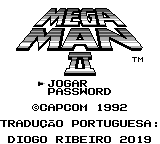
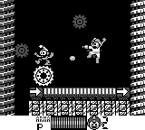
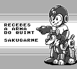
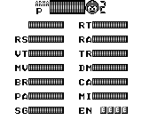
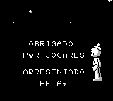

# Mega Man II

## Informações sobre o jogo

| Tipo | Informação |
| ----------- | ----------- |
| Nome | Mega Man II |
| Plataforma | [Game Boy](../) |
| Desenvolvedora | Capcom |
| Distribuidora | Capcom |
| Gênero | Run 'n gun |
| Data de Lançamento | 20/12/1991 |

## Informações sobre a tradução

| Tipo | Informação |
| ----------- | ----------- |
| Última versão | Sim |
| Data de Lançamento | 25/04/2019 |
| Percentual traduzido | 100% |

## Autores

| Autor(a) | Papel na tradução |
| ----------- | ----------- |
| [Diogo Ribeiro](../../../autores/diogo-ribeiro/) | Completo |

## Informações sobre patching

| Aplicar o patch no arquivo | CRC32 Hash | MD5 Hash |
| ----------- | ----------- | ----------- |
| Mega Man II \(U\) \[\!\]\.gb | E496F686 | 7FE07271D04ED9E0BC0663DDE55A2AE4 |

## Páginas sobre a tradução

| URL | Oficial (publicado pelos autores) | Possuí link de download |
| ----------- | ----------- | ----------- |
| [https://www.romhacking.net/translations/4471/](https://www.romhacking.net/translations/4471/) | Não | Sim |

## Imagens da tradução

