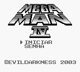

# Mega Man IV

## Informações sobre o jogo

| Tipo | Informação |
| ----------- | ----------- |
| Nome | Mega Man IV |
| Plataforma | [Game Boy](../) |
| Desenvolvedora | Capcom |
| Distribuidora | Capcom |
| Gênero | Run 'n gun |
| Data de Lançamento | (Por volta de) ??/??/1993 |

## Informações sobre a tradução

| Tipo | Informação |
| ----------- | ----------- |
| Versão | 1\.0 |
| Última versão | Sim |
| Data de Lançamento | (Provavelmente) 22/02/2003 |
| Percentual traduzido | None% |

## Autores

| Autor(a) | Papel na tradução |
| ----------- | ----------- |
| [Anonymous\_rs](../../../autores/anonymous_rs/) | Completo |

## Grupos

* [Evil Darkness](../../../grupos/evil-darkness/)

## Informações sobre patching

| Aplicar o patch no arquivo | CRC32 Hash | MD5 Hash |
| ----------- | ----------- | ----------- |
| Mega Man IV \(E\)\.gb | 973FCF4C | 4CEFE39910A0C6DCF9290556FBD29184 |

## Páginas sobre a tradução

| URL | Oficial (publicado pelos autores) | Possuí link de download |
| ----------- | ----------- | ----------- |
| [https://www.zophar.net/translations/gameboy/brazilian-portuguese/mega-man-iv.html](https://www.zophar.net/translations/gameboy/brazilian-portuguese/mega-man-iv.html) | Não | Sim |
| [https://romhackers.org/traducoes/portatil/game-boy/mega-man-iv-evil-darkness/](https://romhackers.org/traducoes/portatil/game-boy/mega-man-iv-evil-darkness/) | Não | Não |

## Imagens da tradução

