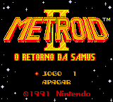
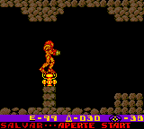

# Metroid II - Return of Samus

## Informações sobre o jogo

| Tipo | Informação |
| ----------- | ----------- |
| Nome | Metroid II \- Return of Samus |
| Plataforma | [Game Boy](../) |
| Desenvolvedora | Nintendo |
| Distribuidora | Nintendo |
| Gênero | Metroidvania |
| Data de Lançamento | (Por volta de) ??/11/1992 |
| Descrição | Continuação direta do Metroid de NES \(também do Metroid Zero Mission, consequentemente\), é o segundo jogo da série Metroid, e também o único lançado para Gameboy\. A jogabilidade é bastante parecida com seu predecessor de NES, porém havendo melhorias gráficas e novos itens\. |

## Informações sobre a tradução

| Tipo | Informação |
| ----------- | ----------- |
| Versão | 1\.1 |
| Última versão | Sim |
| Observação | Não encontrei a versão 1\.1, porém encontrei a ROM traduzida sem o readme, juntei as duas para ficar próximo a versão 1\.1\. |
| Data de Lançamento | 08/03/2009 |
| Percentual traduzido | 100% |

## Autores

| Autor(a) | Papel na tradução |
| ----------- | ----------- |
| [Solid\_One](../../../autores/solid_one/) | Completo |

## Grupos

* [Trans\-Center](../../../grupos/trans-center/)

## Informações sobre patching

| Aplicar o patch no arquivo | CRC32 Hash | MD5 Hash |
| ----------- | ----------- | ----------- |
| Metroid II \- Return of Samus \(W\) \[\!\]\.gb | DEE05370 | 9639948AD274FA15281F549E5F9C4D87 |

## Páginas sobre a tradução

| URL | Oficial (publicado pelos autores) | Possuí link de download |
| ----------- | ----------- | ----------- |
| [https://www.romhacking.net/translations/1861/](https://www.romhacking.net/translations/1861/) | Sim | Sim |
| [https://www.zophar.net/translations/gameboy/brazilian-portuguese/metroid-ii-return-of-samus.html](https://www.zophar.net/translations/gameboy/brazilian-portuguese/metroid-ii-return-of-samus.html) | Não | Sim |
| [https://romhackers.org/traducoes/portatil/game-boy/metroid-ii-return-of-samus-trans-center/](https://romhackers.org/traducoes/portatil/game-boy/metroid-ii-return-of-samus-trans-center/) | Não | Não |

## Imagens da tradução

