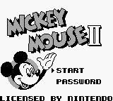
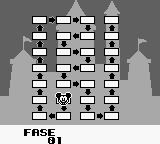
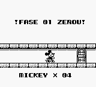

# Mickey Mouse II

## Informações sobre o jogo

| Tipo | Informação |
| ----------- | ----------- |
| Nome | Mickey Mouse II |
| Plataforma | [Game Boy](../) |
| Desenvolvedora | Kotobuki Systems |
| Distribuidora | Kotobuki Systems |
| Gênero | Ação / Plataforma |
| Data de Lançamento | 26/04/1991 |

## Informações sobre a tradução

| Tipo | Informação |
| ----------- | ----------- |
| Última versão | Sim |
| Data de Lançamento | (Provavelmente) 16/01/2001 |
| Percentual traduzido | None% |

## Autores

| Autor(a) | Papel na tradução |
| ----------- | ----------- |
| [Sergiomhouse](../../../autores/sergiomhouse/) | Completo |

## Grupos

* [Tradumix](../../../grupos/tradumix/)

## Informações sobre patching

| Aplicar o patch no arquivo | CRC32 Hash | MD5 Hash |
| ----------- | ----------- | ----------- |
| Mickey Mouse II \(J\)\.gb | DFEE8BCC | 9F5DDC6EE110A6843B1D9D9A08514C71 |

## Páginas sobre a tradução

| URL | Oficial (publicado pelos autores) | Possuí link de download |
| ----------- | ----------- | ----------- |
| [https://www.zophar.net/translations/gameboy/brazilian-portuguese/mickey-mouse-ii.html](https://www.zophar.net/translations/gameboy/brazilian-portuguese/mickey-mouse-ii.html) | Não | Sim |
| [https://romhackers.org/traducoes/portatil/game-boy/mickey-mouse-ii-tradumix/](https://romhackers.org/traducoes/portatil/game-boy/mickey-mouse-ii-tradumix/) | Não | Não |

## Imagens da tradução

