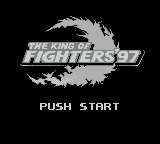
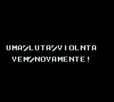
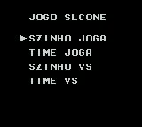

# Nettou King of Fighters '97

## Informações sobre o jogo

| Tipo | Informação |
| ----------- | ----------- |
| Nome | Nettou King of Fighters '97 |
| Plataforma | [Game Boy](../) |
| Desenvolvedora | Takara |
| Distribuidora | Takara |
| Gênero | Luta |
| Data de Lançamento | (Por volta de) ??/??/1997 |

## Informações sobre a tradução

| Tipo | Informação |
| ----------- | ----------- |
| Última versão | Sim |
| Data de Lançamento | (Provavelmente) 19/07/2000 |
| Percentual traduzido | None% |

## Autores

| Autor(a) | Papel na tradução |
| ----------- | ----------- |
| [Matt](../../../autores/matt/) | Completo |

## Informações sobre patching

| Aplicar o patch no arquivo | CRC32 Hash | MD5 Hash |
| ----------- | ----------- | ----------- |
| Nettou King of Fighters ‘97 \(J\) \[S\]\[p1\]\.gb | AC61EF47 | E33EC62A1EDF76DEB6F86D7CD9B8165A |

## Páginas sobre a tradução

| URL | Oficial (publicado pelos autores) | Possuí link de download |
| ----------- | ----------- | ----------- |
| [https://www.zophar.net/translations/gameboy/portuguese/king-of-fighters-97.html](https://www.zophar.net/translations/gameboy/portuguese/king-of-fighters-97.html) | Não | Sim |
| [https://romhackers.org/traducoes/portatil/game-boy/nettou-king-of-fighters-97-tradu-roms/](https://romhackers.org/traducoes/portatil/game-boy/nettou-king-of-fighters-97-tradu-roms/) | Não | Não |

## Imagens da tradução

