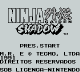
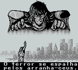
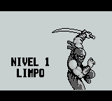

# Ninja Gaiden Shadow

## Informações sobre o jogo

| Tipo | Informação |
| ----------- | ----------- |
| Nome | Ninja Gaiden Shadow |
| Plataforma | [Game Boy](../) |
| Desenvolvedora | Tecmo (Tehkan LTDA) |
| Distribuidora | Tecmo (Tehkan LTDA) |
| Gênero | Ação / Plataforma |
| Data de Lançamento | (Por volta de) ??/??/1991 |

## Informações sobre a tradução

| Tipo | Informação |
| ----------- | ----------- |
| Última versão | Sim |
| Data de Lançamento | (Provavelmente) 13/08/1997 |
| Percentual traduzido | None% |

## Autores

| Autor(a) | Papel na tradução |
| ----------- | ----------- |
| [Hellmatic](../../../autores/hellmatic/) | Completo |

## Grupos

* [Emulação Brasil](../../../grupos/emulacao-brasil/)

## Informações sobre patching

| Aplicar o patch no arquivo | CRC32 Hash | MD5 Hash |
| ----------- | ----------- | ----------- |
| Ninja Gaiden Shadow \(U\)\.gb | D3741A3A | E12C5C2897ED095F8D26C7578AFDDFDA |

## Páginas sobre a tradução

| URL | Oficial (publicado pelos autores) | Possuí link de download |
| ----------- | ----------- | ----------- |
| [https://www.zophar.net/translations/gameboy/brazilian-portuguese/ninja-gaiden-shadow-xku.html](https://www.zophar.net/translations/gameboy/brazilian-portuguese/ninja-gaiden-shadow-xku.html) | Não | Sim |
| [https://romhackers.org/traducoes/portatil/game-boy/ninja-gaiden-shadow-emulacao-brasil/](https://romhackers.org/traducoes/portatil/game-boy/ninja-gaiden-shadow-emulacao-brasil/) | Não | Não |

## Imagens da tradução

