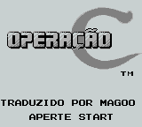
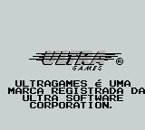
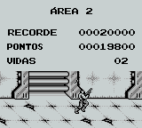

# Operation C

## Informações sobre o jogo

| Tipo | Informação |
| ----------- | ----------- |
| Nome | Operation C |
| Plataforma | [Game Boy](../) |
| Desenvolvedora | Konami |
| Distribuidora | Ultra Games |
| Gênero | Run 'n gun |
| Data de Lançamento | (Por volta de) ??/??/1991 |

## Informações sobre a tradução

| Tipo | Informação |
| ----------- | ----------- |
| Versão | 1\.0 |
| Última versão | Sim |
| Data de Lançamento | 05/05/2009 |
| Percentual traduzido | 100% |

## Autores

| Autor(a) | Papel na tradução |
| ----------- | ----------- |
| [Mr\. Magoo](../../../autores/mr-magoo/) | Completo |

## Informações sobre patching

| Aplicar o patch no arquivo | CRC32 Hash | MD5 Hash |
| ----------- | ----------- | ----------- |
| Operation C \(U\) \[\!\]\.gb | 2EBBC1AE | C6EFFB3A51B36056411760D1FFE048F7 |

## Páginas sobre a tradução

| URL | Oficial (publicado pelos autores) | Possuí link de download |
| ----------- | ----------- | ----------- |
| [https://www.zophar.net/translations/gameboy/brazilian-portuguese/operation-c.html](https://www.zophar.net/translations/gameboy/brazilian-portuguese/operation-c.html) | Não | Sim |
| [https://romhackers.org/traducoes/portatil/game-boy/operation-c-mr.magoo/](https://romhackers.org/traducoes/portatil/game-boy/operation-c-mr.magoo/) | Não | Não |

## Imagens da tradução

