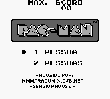
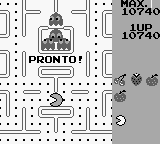
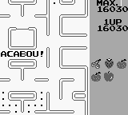

# Pac-Man

## Informações sobre o jogo

| Tipo | Informação |
| ----------- | ----------- |
| Nome | Pac\-Man |
| Plataforma | [Game Boy](../) |
| Desenvolvedora | NAMCO |
| Distribuidora | NAMCO |
| Gênero | Ação |
| Data de Lançamento | (Por volta de) ??/??/1991 |

## Informações sobre a tradução

| Tipo | Informação |
| ----------- | ----------- |
| Última versão | Sim |
| Data de Lançamento | (Provavelmente) 16/01/2001 |
| Percentual traduzido | None% |

## Autores

| Autor(a) | Papel na tradução |
| ----------- | ----------- |
| [Sergiomhouse](../../../autores/sergiomhouse/) | Completo |

## Grupos

* [Tradumix](../../../grupos/tradumix/)

## Informações sobre patching

| Aplicar o patch no arquivo | CRC32 Hash | MD5 Hash |
| ----------- | ----------- | ----------- |
| Pac\-Man \(U\) \(Namco\)\.gb | 0509069C | CD9027E147F4605F26EE261C537441B3 |

## Páginas sobre a tradução

| URL | Oficial (publicado pelos autores) | Possuí link de download |
| ----------- | ----------- | ----------- |
| [https://www.zophar.net/translations/gameboy/brazilian-portuguese/pac-man.html](https://www.zophar.net/translations/gameboy/brazilian-portuguese/pac-man.html) | Não | Sim |
| [https://romhackers.org/traducoes/portatil/game-boy/pac-man-tradumix/](https://romhackers.org/traducoes/portatil/game-boy/pac-man-tradumix/) | Não | Não |

## Imagens da tradução

