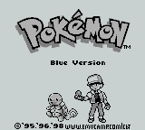
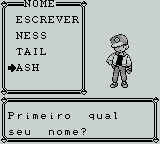
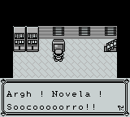

# Pokemon - Blue Version

## Informações sobre o jogo

| Tipo | Informação |
| ----------- | ----------- |
| Nome | Pokemon \- Blue Version |
| Plataforma | [Game Boy](../) |
| Desenvolvedora | Game Freak |
| Distribuidora | Nintendo |
| Gênero | RPG |
| Data de Lançamento | 26/11/1996 |

## Informações sobre a tradução

| Tipo | Informação |
| ----------- | ----------- |
| Versão | 1\.2 |
| Última versão | Sim |
| Data de Lançamento | 26/11/1999 |
| Percentual traduzido | 100% |

## Autores

| Autor(a) | Papel na tradução |
| ----------- | ----------- |
| [Samurai\_Pizza](../../../autores/samurai_pizza/) | Completo |

## Grupos

* [CBT](../../../grupos/cbt/)

## Informações sobre patching

| Formato do patch | Aplicar o patch no arquivo | CRC32 Hash | MD5 Hash |
| ----------- | ----------- | ----------- | ----------- |
| IPS | Pokemon \- Blue Version \(UE\) \[S\]\[\!\]\.gb | D6DA8A1A | 50927E843568814F7ED45EC4F944BD8B |

## Páginas sobre a tradução

| URL | Oficial (publicado pelos autores) | Possuí link de download |
| ----------- | ----------- | ----------- |
| [https://www.romhacking.net/translations/1869/](https://www.romhacking.net/translations/1869/) | Não | Sim |
| [https://www.zophar.net/translations/gameboy/portuguese/pokemon-blue.html](https://www.zophar.net/translations/gameboy/portuguese/pokemon-blue.html) | Não | Sim |
| [https://romhackers.org/traducoes/portatil/game-boy/pokemon-blue-version-cbt/](https://romhackers.org/traducoes/portatil/game-boy/pokemon-blue-version-cbt/) | Não | Não |

## Imagens da tradução

