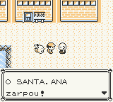
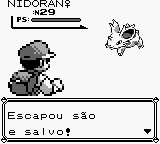
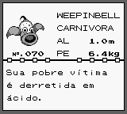

# Pokémon - Yellow Version - Special Pikachu Edition

## Informações sobre o jogo

| Tipo | Informação |
| ----------- | ----------- |
| Nome | Pokémon \- Yellow Version \- Special Pikachu Edition |
| Plataforma | [Game Boy](../) |
| Desenvolvedora | Game Freak |
| Distribuidora | Nintendo |
| Gênero | RPG |
| Data de Lançamento | 12/09/1998 |

## Informações sobre a tradução

| Tipo | Informação |
| ----------- | ----------- |
| Versão | 2\.0 |
| Última versão | Sim |
| Data de Lançamento | 15/12/2022 |
| Percentual traduzido | None% |

## Autores

| Autor(a) | Papel na tradução |
| ----------- | ----------- |
| [ChocoLixo](../../../autores/chocolixo/) | Completo |

## Informações sobre patching

| Aplicar o patch no arquivo | CRC32 Hash | MD5 Hash |
| ----------- | ----------- | ----------- |
| Pokemon \- Edicion Amarilla \- Edicion Especial Pikachu \(Spain\) \(CGB\+SGB Enhanced\)\.gb | 964B7A10 | F0DA8B1CFF3AAB898ECDE9DCBDA6D817 |

## Páginas sobre a tradução

| URL | Oficial (publicado pelos autores) | Possuí link de download |
| ----------- | ----------- | ----------- |
| [https://www.romhacking.net/translations/6636/](https://www.romhacking.net/translations/6636/) | Sim | Sim |
| [https://joao13traducoes.com/2022/09/gb-pokemon-yellow-version-special-pikachu-edition-chocolixo/](https://joao13traducoes.com/2022/09/gb-pokemon-yellow-version-special-pikachu-edition-chocolixo/) | Não | Sim, porém o arquivo ou página de download exige uma senha |

## Imagens da tradução

