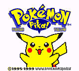
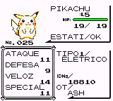
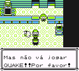

# Pokémon - Yellow Version

## Informações sobre o jogo

| Tipo | Informação |
| ----------- | ----------- |
| Nome | Pokémon \- Yellow Version |
| Plataforma | [Game Boy](../) |
| Desenvolvedora | Game Freak |
| Distribuidora | Nintendo |
| Gênero | RPG |
| Data de Lançamento | 19/10/1999 |

## Informações sobre a tradução

| Tipo | Informação |
| ----------- | ----------- |
| Versão | 1\.3 |
| Última versão | Sim |
| Data de Lançamento | 31/10/1999 |
| Percentual traduzido | None% |

## Autores

| Autor(a) | Papel na tradução |
| ----------- | ----------- |
| [Samurai\_Pizza](../../../autores/samurai_pizza/) | Completo |

## Grupos

* [CBT](../../../grupos/cbt/)

## Informações sobre patching

| Aplicar o patch no arquivo | CRC32 Hash | MD5 Hash |
| ----------- | ----------- | ----------- |
| Pokemon \- Yellow Version \(UE\) \[C\]\[\!\]\.gbc | 7D527D62 | D9290DB87B1F0A23B89F99EE4469E34B |

## Páginas sobre a tradução

| URL | Oficial (publicado pelos autores) | Possuí link de download |
| ----------- | ----------- | ----------- |
| [https://www.zophar.net/translations/gameboy/portuguese/pokemon-yellow.html](https://www.zophar.net/translations/gameboy/portuguese/pokemon-yellow.html) | Não | Sim |
| [https://romhackers.org/traducoes/portatil/game-boy-color/pokemon-yellow-version-cbt/](https://romhackers.org/traducoes/portatil/game-boy-color/pokemon-yellow-version-cbt/) | Não | Não |

## Imagens da tradução

