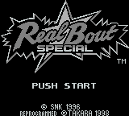
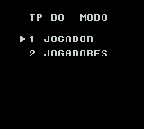
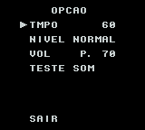

# Real Bout Special

## Informações sobre o jogo

| Tipo | Informação |
| ----------- | ----------- |
| Nome | Real Bout Special |
| Plataforma | [Game Boy](../) |
| Desenvolvedora | Takara |
| Distribuidora | Takara |
| Gênero | Luta |
| Data de Lançamento | 27/03/1998 |

## Informações sobre a tradução

| Tipo | Informação |
| ----------- | ----------- |
| Última versão | Sim |
| Data de Lançamento | (Provavelmente) 19/07/2000 |
| Percentual traduzido | None% |

## Autores

| Autor(a) | Papel na tradução |
| ----------- | ----------- |
| [Matt](../../../autores/matt/) | Completo |

## Informações sobre patching

| Formato do patch | Aplicar o patch no arquivo | CRC32 Hash | MD5 Hash |
| ----------- | ----------- | ----------- | ----------- |
| IPS | Real Bout Special \(J\) \[S\]\.gb | F4031D4C | 4C24F644E70F0786D20D8CA9FFCEA51C |

## Páginas sobre a tradução

| URL | Oficial (publicado pelos autores) | Possuí link de download |
| ----------- | ----------- | ----------- |
| [https://www.romhacking.net/translations/1866/](https://www.romhacking.net/translations/1866/) | Não | Sim |
| [https://www.zophar.net/translations/gameboy/portuguese/fatal-fury-real-bout.html](https://www.zophar.net/translations/gameboy/portuguese/fatal-fury-real-bout.html) | Não | Sim |
| [https://romhackers.org/traducoes/portatil/game-boy/nettou-real-bout-garou-densetsu-special-tradu-roms/](https://romhackers.org/traducoes/portatil/game-boy/nettou-real-bout-garou-densetsu-special-tradu-roms/) | Não | Não |

## Imagens da tradução

