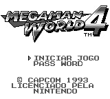
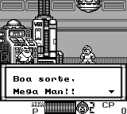
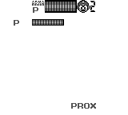

# Rockman World 4

## Informações sobre o jogo

| Tipo | Informação |
| ----------- | ----------- |
| Nome | Rockman World 4 |
| Plataforma | [Game Boy](../) |
| Desenvolvedora | Capcom |
| Distribuidora | Capcom |
| Gênero | Run 'n gun |
| Data de Lançamento | 29/10/1993 |
| Descrição | Mega Man World 4 \(Rockman World 4\) é um jogo produzido pela Capcom para o Game Boy\. É a quarta edição da versão para o portátil da série Mega Man\.
O jogo continua com a mesma história do protagonista Mega Man em uma luta interminável com o seu inimigo de longa data, o Dr\. Wily\. |

## Informações sobre a tradução

| Tipo | Informação |
| ----------- | ----------- |
| Versão | 1\.0 |
| Última versão | Sim |
| Data de Lançamento | 28/02/2017 |
| Percentual traduzido | 99% |

## Autores

| Autor(a) | Papel na tradução |
| ----------- | ----------- |
| [Maverick Blue Warrior](../../../autores/maverick-blue-warrior/) | Completo |

## Informações sobre patching

| Formato do patch | Aplicar o patch no arquivo | CRC32 Hash | MD5 Hash |
| ----------- | ----------- | ----------- | ----------- |
| IPS | Rockman World 4 \(J\)\.gb | 16AEC559 | 401647AD59208D67507245AC13E3894C |

## Páginas sobre a tradução

| URL | Oficial (publicado pelos autores) | Possuí link de download |
| ----------- | ----------- | ----------- |
| [https://www.romhacking.net.br/index.php?topic=119](https://www.romhacking.net.br/index.php?topic=119) | Sim | Sim, porém é necessário realizar login |
| [https://romhackers.org/traducoes/portatil/game-boy/rockman-world-4-maverick-blue-warrior/](https://romhackers.org/traducoes/portatil/game-boy/rockman-world-4-maverick-blue-warrior/) | Não | Não |

## Imagens da tradução

