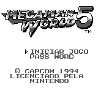
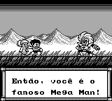
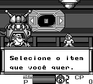

# Rockman World 5

## Informações sobre o jogo

| Tipo | Informação |
| ----------- | ----------- |
| Nome | Rockman World 5 |
| Plataforma | [Game Boy](../) |
| Desenvolvedora | Capcom |
| Distribuidora | Capcom |
| Gênero | Run 'n gun |
| Data de Lançamento | 22/07/1994 |
| Descrição | Mega Man World 5 \(Rockman World 5\) é o ultimo jogo da franquia a ser lançado para o Game Boy, diferente dos outros jogos lançados para o portatil, este jogo possui os próprios chefes: os &quot;Stardroids&quot;\. |

## Informações sobre a tradução

| Tipo | Informação |
| ----------- | ----------- |
| Versão | 1\.0 |
| Última versão | Sim |
| Data de Lançamento | 26/02/2017 |
| Percentual traduzido | 100% |

## Autores

| Autor(a) | Papel na tradução |
| ----------- | ----------- |
| [Maverick Blue Warrior](../../../autores/maverick-blue-warrior/) | Completo |

## Informações sobre patching

| Formato do patch | Aplicar o patch no arquivo | CRC32 Hash | MD5 Hash |
| ----------- | ----------- | ----------- | ----------- |
| IPS | Rockman World 5 \(J\) \[S\]\.gb | EEABD3C6 | 309FC69D5AB1D2B17D0BBC127FAF04C1 |

## Páginas sobre a tradução

| URL | Oficial (publicado pelos autores) | Possuí link de download |
| ----------- | ----------- | ----------- |
| [https://www.romhacking.net.br/index.php?topic=114](https://www.romhacking.net.br/index.php?topic=114) | Sim | Sim, porém é necessário realizar login |
| [https://romhackers.org/traducoes/portatil/game-boy/rockman-world-5-maverick-blue-warrior/](https://romhackers.org/traducoes/portatil/game-boy/rockman-world-5-maverick-blue-warrior/) | Não | Não |

## Imagens da tradução

