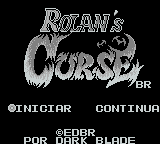
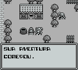
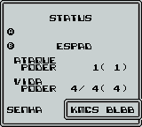

# Rolan's Curse

## Informações sobre o jogo

| Tipo | Informação |
| ----------- | ----------- |
| Nome | Rolan's Curse |
| Plataforma | [Game Boy](../) |
| Desenvolvedora | NMK |
| Distribuidora | American Sammy |
| Gênero | RPG / Ação |
| Data de Lançamento | 26/10/1990 |

## Informações sobre a tradução

| Tipo | Informação |
| ----------- | ----------- |
| Versão | 1\.1b |
| Última versão | Sim |
| Data de Lançamento | 04/08/2002 |
| Percentual traduzido | 100% |

## Autores

| Autor(a) | Papel na tradução |
| ----------- | ----------- |
| [Dark\_Blade](../../../autores/dark_blade/) | Completo |

## Informações sobre patching

| Formato do patch | Aplicar o patch no arquivo | CRC32 Hash | MD5 Hash |
| ----------- | ----------- | ----------- | ----------- |
| IPS | Rolan's Curse \(U\) \[\!\]\.gb | 1A602590 | EBD1866DC6C13CA48F45538ED33EA46F |

## Páginas sobre a tradução

| URL | Oficial (publicado pelos autores) | Possuí link de download |
| ----------- | ----------- | ----------- |
| [https://www.romhacking.net/translations/1941/](https://www.romhacking.net/translations/1941/) | Não | Sim |
| [https://www.zophar.net/translations/gameboy/portuguese/rolan-s-curse.html](https://www.zophar.net/translations/gameboy/portuguese/rolan-s-curse.html) | Não | Sim |
| [https://romhackers.org/traducoes/portatil/game-boy/rolans-curse-evil-darkness/](https://romhackers.org/traducoes/portatil/game-boy/rolans-curse-evil-darkness/) | Não | Não |

## Imagens da tradução

