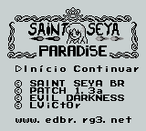
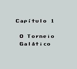
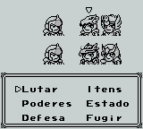

# SD Saint Seiya Paradise

## Informações sobre o jogo

| Tipo | Informação |
| ----------- | ----------- |
| Nome | SD Saint Seiya Paradise |
| Plataforma | [Game Boy](../) |
| Desenvolvedora | Bandai |
| Distribuidora | Bandai |
| Gênero | RPG |
| Data de Lançamento | 21/07/2002 |

## Informações sobre a tradução

| Tipo | Informação |
| ----------- | ----------- |
| Versão | 1\.3a |
| Última versão | Sim |
| Data de Lançamento | 21/07/2002 |
| Percentual traduzido | 100% |

## Autores

| Autor(a) | Papel na tradução |
| ----------- | ----------- |
| [L\_VicT0r](../../../autores/l_vict0r/) | Completo |

## Grupos

* [Evil Darkness](../../../grupos/evil-darkness/)

## Informações sobre patching

| Formato do patch | Aplicar o patch no arquivo | CRC32 Hash | MD5 Hash |
| ----------- | ----------- | ----------- | ----------- |
| IPS | SD Saint Seiya Paradise \(J\)\.gb | D6FE3C56 | 4D2EC4DA71D11F95367D9163C89B70F9 |

## Páginas sobre a tradução

| URL | Oficial (publicado pelos autores) | Possuí link de download |
| ----------- | ----------- | ----------- |
| [https://www.romhacking.net/translations/1865/](https://www.romhacking.net/translations/1865/) | Não | Sim |
| [https://www.zophar.net/translations/gameboy/brazilian-portuguese/sd-saint-seiya-paradise.html](https://www.zophar.net/translations/gameboy/brazilian-portuguese/sd-saint-seiya-paradise.html) | Não | Sim |
| [https://romhackers.org/traducoes/portatil/game-boy/saint-paradise-saikyou-no-senshitachi-evil-darkness/](https://romhackers.org/traducoes/portatil/game-boy/saint-paradise-saikyou-no-senshitachi-evil-darkness/) | Não | Não |

## Imagens da tradução

