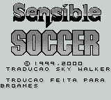
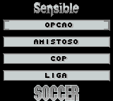
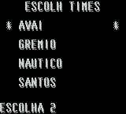

# Sensible Soccer

## Informações sobre o jogo

| Tipo | Informação |
| ----------- | ----------- |
| Nome | Sensible Soccer |
| Plataforma | [Game Boy](../) |
| Desenvolvedora | Enigma Variations |
| Distribuidora | Sony |
| Gênero | Esportes |
| Data de Lançamento | (Por volta de) ??/??/1993 |

## Informações sobre a tradução

| Tipo | Informação |
| ----------- | ----------- |
| Última versão | Sim |
| Data de Lançamento | 04/03/2000 |
| Percentual traduzido | None% |

## Autores

| Autor(a) | Papel na tradução |
| ----------- | ----------- |
| [Sky Walker](../../../autores/sky-walker/) | Completo |

## Grupos

* [BRGames](../../../grupos/brgames/)

## Informações sobre patching

| Aplicar o patch no arquivo | CRC32 Hash | MD5 Hash |
| ----------- | ----------- | ----------- |
| Sensible Soccer \- European Champions \(E\)\.gb | BD022658 | 3AE8ECEB23913AEB1A655DA481541A6B |

## Páginas sobre a tradução

| URL | Oficial (publicado pelos autores) | Possuí link de download |
| ----------- | ----------- | ----------- |
| [https://www.romhacking.net/translations/1864/](https://www.romhacking.net/translations/1864/) | Não | Sim |
| [https://www.zophar.net/translations/gameboy/brazilian-portuguese/sensible-soccer.html](https://www.zophar.net/translations/gameboy/brazilian-portuguese/sensible-soccer.html) | Não | Sim |
| [https://romhackers.org/traducoes/portatil/game-boy/sensible-soccer-br-games/](https://romhackers.org/traducoes/portatil/game-boy/sensible-soccer-br-games/) | Não | Não |

## Imagens da tradução

