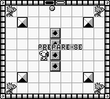

# Snoopy's Magic Show

## Informações sobre o jogo

| Tipo | Informação |
| ----------- | ----------- |
| Nome | Snoopy's Magic Show |
| Plataforma | [Game Boy](../) |
| Desenvolvedora | Kemco |
| Distribuidora | Kemco |
| Gênero | Puzzle |
| Data de Lançamento | (Por volta de) ??/??/1990 |

## Informações sobre a tradução

| Tipo | Informação |
| ----------- | ----------- |
| Versão | 1\.0 |
| Última versão | Sim |
| Data de Lançamento | 20/03/2009 |
| Percentual traduzido | 100% |

## Autores

| Autor(a) | Papel na tradução |
| ----------- | ----------- |
| [Lobim](../../../autores/lobim/) | Completo |

## Grupos

* [Monkey's Traduções](../../../grupos/monkeys-traducoes/)

## Informações sobre patching

| Aplicar o patch no arquivo | CRC32 Hash | MD5 Hash |
| ----------- | ----------- | ----------- |
| Snoopy \- Magic Show \(U\) \[\!\]\.gb | 2B7A5034 | 8A06994B2E265244147A4D6D0E80623F |

## Páginas sobre a tradução

| URL | Oficial (publicado pelos autores) | Possuí link de download |
| ----------- | ----------- | ----------- |
| [https://www.zophar.net/translations/gameboy/brazilian-portuguese/snoopys-magic-show.html](https://www.zophar.net/translations/gameboy/brazilian-portuguese/snoopys-magic-show.html) | Não | Sim |
| [https://romhackers.org/traducoes/portatil/game-boy/snoopys-magic-show-monkeys-traducoes/](https://romhackers.org/traducoes/portatil/game-boy/snoopys-magic-show-monkeys-traducoes/) | Não | Não |

## Imagens da tradução

