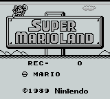
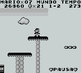
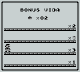

# Super Mario Land

## Informações sobre o jogo

| Tipo | Informação |
| ----------- | ----------- |
| Nome | Super Mario Land |
| Plataforma | [Game Boy](../) |
| Desenvolvedora | Nintendo |
| Distribuidora | Nintendo |
| Gênero | Ação / Plataforma |
| Data de Lançamento | 21/04/1989 |

## Informações sobre a tradução

| Tipo | Informação |
| ----------- | ----------- |
| Última versão | Sim |
| Data de Lançamento | 25/03/2000 |
| Percentual traduzido | None% |

## Autores

| Autor(a) | Papel na tradução |
| ----------- | ----------- |
| [Jackal](../../../autores/jackal/) | Completo |

## Grupos

* [BRGames](../../../grupos/brgames/)

## Informações sobre patching

| Formato do patch | Aplicar o patch no arquivo | CRC32 Hash | MD5 Hash |
| ----------- | ----------- | ----------- | ----------- |
| IPS | Super Mario Land \(JUE\) \(V1\.1\) \[\!\]\.gb | 2C27EC70 | B259FEB41811C7E4E1DC200167985C84 |

## Páginas sobre a tradução

| URL | Oficial (publicado pelos autores) | Possuí link de download |
| ----------- | ----------- | ----------- |
| [https://www.romhacking.net/translations/1863/](https://www.romhacking.net/translations/1863/) | Não | Sim |
| [https://www.zophar.net/translations/gameboy/brazilian-portuguese/super-mario-land.html](https://www.zophar.net/translations/gameboy/brazilian-portuguese/super-mario-land.html) | Não | Sim |
| [https://romhackers.org/traducoes/portatil/game-boy/super-mario-land-br-games/](https://romhackers.org/traducoes/portatil/game-boy/super-mario-land-br-games/) | Não | Não |

## Imagens da tradução

