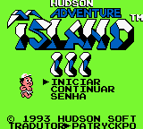

# Takahashi Meijin no Boukenjima III

## Informações sobre o jogo

| Tipo | Informação |
| ----------- | ----------- |
| Nome | Takahashi Meijin no Boukenjima III |
| Plataforma | [Game Boy](../) |
| Desenvolvedora | Hudson |
| Distribuidora | Nintendo |
| Gênero | Ação / Plataforma |
| Data de Lançamento | 26/02/1993 |
| Descrição | Mais uma vez, controle Master Higgins em vários níveis enquanto tenta salvar Tina \(mais uma vez\), que foi raptada por alienígenas\. |

## Informações sobre a tradução

| Tipo | Informação |
| ----------- | ----------- |
| Versão | 1\.0 |
| Última versão | Sim |
| Data de Lançamento | 09/07/2018 |
| Percentual traduzido | 100% |

## Autores

| Autor(a) | Papel na tradução |
| ----------- | ----------- |
| [patryckpo](../../../autores/patryckpo/) | Romhacking e Tradução |
| [ajkmetiuk](../../../autores/ajkmetiuk/) | ROMHacking, Testes e Revisor |

## Informações sobre patching

| Formato do patch | Aplicar o patch no arquivo | CRC32 Hash | MD5 Hash |
| ----------- | ----------- | ----------- | ----------- |
| IPS | Takahashi Meijin no Bouken Shima III \(J\)\.gb | F8FC0B41 | A291DD1F541FAC1D57019E4A3D0FFD08 |

## Páginas sobre a tradução

| URL | Oficial (publicado pelos autores) | Possuí link de download |
| ----------- | ----------- | ----------- |
| [https://www.romhacking.net.br/index.php?topic=750](https://www.romhacking.net.br/index.php?topic=750) | Sim | Sim, porém é necessário realizar login |
| [https://romhackers.org/traducoes/portatil/game-boy/takahashi-meijin-no-boukenjima-iii-patryck/](https://romhackers.org/traducoes/portatil/game-boy/takahashi-meijin-no-boukenjima-iii-patryck/) | Não | Não |
| [https://joao13traducoes.com/2018/07/gb-takahashi-meijin-no-boukenjima-iii-patryck-ajkmetiuk/](https://joao13traducoes.com/2018/07/gb-takahashi-meijin-no-boukenjima-iii-patryck-ajkmetiuk/) | Não | Sim, porém o arquivo ou página de download exige uma senha |

## Imagens da tradução

