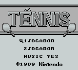
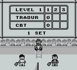
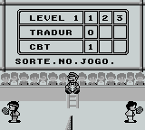

# Tennis

## Informações sobre o jogo

| Tipo | Informação |
| ----------- | ----------- |
| Nome | Tennis |
| Plataforma | [Game Boy](../) |
| Desenvolvedora | Nintendo |
| Distribuidora | Nintendo |
| Gênero | Esportes |
| Data de Lançamento | 29/03/1989 |

## Informações sobre a tradução

| Tipo | Informação |
| ----------- | ----------- |
| Última versão | Sim |
| Data de Lançamento | (Por volta de) ??/??/2000 |
| Percentual traduzido | None% |

## Autores

| Autor(a) | Papel na tradução |
| ----------- | ----------- |
| [GuilhermeD2](../../../autores/guilhermed2/) | Completo |

## Grupos

* [Tradu\-Roms](../../../grupos/tradu-roms/)

## Informações sobre patching

| Formato do patch | Aplicar o patch no arquivo | CRC32 Hash | MD5 Hash |
| ----------- | ----------- | ----------- | ----------- |
| IPS | Tennis \(JUE\) \[\!\]\.gb | 5009215F | 7D621DCBBCE12B73574C42F40DEEC275 |

## Páginas sobre a tradução

| URL | Oficial (publicado pelos autores) | Possuí link de download |
| ----------- | ----------- | ----------- |
| [https://www.romhacking.net/translations/1859/](https://www.romhacking.net/translations/1859/) | Não | Sim |
| [https://www.zophar.net/translations/gameboy/brazilian-portuguese/tennis.html](https://www.zophar.net/translations/gameboy/brazilian-portuguese/tennis.html) | Não | Sim |
| [https://romhackers.org/traducoes/portatil/game-boy/tennis-tradu-roms/](https://romhackers.org/traducoes/portatil/game-boy/tennis-tradu-roms/) | Não | Não |

## Imagens da tradução

