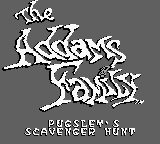
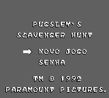
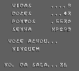

# The Addams Family - Pugsley's Scavenger Hunt

## Informações sobre o jogo

| Tipo | Informação |
| ----------- | ----------- |
| Nome | The Addams Family \- Pugsley's Scavenger Hunt |
| Plataforma | [Game Boy](../) |
| Desenvolvedora | Enigma Variations |
| Distribuidora | Ocean |
| Gênero | Ação / Plataforma |
| Data de Lançamento | (Por volta de) ??/07/1993 |
| Descrição | Neste jogo um tanto reduzido \(MESMO\), você controla Pugsley, onde ele busca sua família que está presa dentro da mansão\. Se procurar sobre esta versão, verá que é melhor jogar no SNES\. |

## Informações sobre a tradução

| Tipo | Informação |
| ----------- | ----------- |
| Versão | 1\.0 |
| Última versão | Sim |
| Data de Lançamento | 14/08/2015 |
| Percentual traduzido | 90% |

## Autores

| Autor(a) | Papel na tradução |
| ----------- | ----------- |
| [patryckpo](../../../autores/patryckpo/) | Completo |

## Informações sobre patching

| Aplicar o patch no arquivo | CRC32 Hash | MD5 Hash |
| ----------- | ----------- | ----------- |
| Addams Family, The – Pugsley’s Scavenger Hunt \(U\)\.gb | 7E054A88 | 57726C28DC09949029A154F63B891DD0 |

## Páginas sobre a tradução

| URL | Oficial (publicado pelos autores) | Possuí link de download |
| ----------- | ----------- | ----------- |
| [https://patryckpo.com/traducoes/gb/pugsley-scavenger-hunt/](https://patryckpo.com/traducoes/gb/pugsley-scavenger-hunt/) | Sim | Sim |
| [https://romhackers.org/traducoes/portatil/game-boy/the-addams-family-pugsleys-scavenger-hunt-patryck/](https://romhackers.org/traducoes/portatil/game-boy/the-addams-family-pugsleys-scavenger-hunt-patryck/) | Não | Não |

## Imagens da tradução

