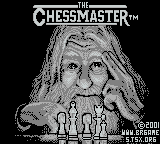
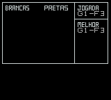
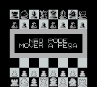

# The Chessmaster

## Informações sobre o jogo

| Tipo | Informação |
| ----------- | ----------- |
| Nome | The Chessmaster |
| Plataforma | [Game Boy](../) |
| Desenvolvedora | Park Place |
| Distribuidora | Hi Tech Expressions |
| Gênero | Puzzle |
| Data de Lançamento | (Por volta de) ??/01/1991 |

## Informações sobre a tradução

| Tipo | Informação |
| ----------- | ----------- |
| Última versão | Sim |
| Data de Lançamento | 27/05/2001 |
| Percentual traduzido | None% |

## Autores

| Autor(a) | Papel na tradução |
| ----------- | ----------- |
| [Wolf](../../../autores/wolf/) | Completo |

## Grupos

* [BRGames](../../../grupos/brgames/)

## Informações sobre patching

| Formato do patch | Aplicar o patch no arquivo | CRC32 Hash | MD5 Hash |
| ----------- | ----------- | ----------- | ----------- |
| IPS | Chessmaster, The \(USA\) \(Rev 1\)\.gb | 59ED370C | 6B6D4A25D3C1E2890B22271C44E62DBF |

## Páginas sobre a tradução

| URL | Oficial (publicado pelos autores) | Possuí link de download |
| ----------- | ----------- | ----------- |
| [https://www.romhacking.net/translations/1858/](https://www.romhacking.net/translations/1858/) | Não | Sim |
| [https://www.zophar.net/translations/gameboy/brazilian-portuguese/the-chessmaster.html](https://www.zophar.net/translations/gameboy/brazilian-portuguese/the-chessmaster.html) | Não | Sim |
| [https://romhackers.org/traducoes/portatil/game-boy/the-chessmaster-br-games/](https://romhackers.org/traducoes/portatil/game-boy/the-chessmaster-br-games/) | Não | Não |

## Imagens da tradução

