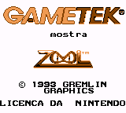
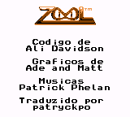
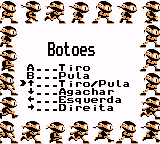
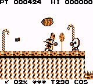

# Zool - Ninja of the Nth Dimension

## Informações sobre o jogo

| Tipo | Informação |
| ----------- | ----------- |
| Nome | Zool \- Ninja of the Nth Dimension |
| Plataforma | [Game Boy](../) |
| Desenvolvedora | Gremlin Graphics |
| Distribuidora | GameTek |
| Gênero | Ação / Plataforma |
| Data de Lançamento | (Por volta de) ??/??/1993 |
| Descrição | Controle Zool em 6 mundos diferentes coletando vários itens \(doces e frutas\) enquanto tenta escapar dos ataques inimigos que se lançarão ou lançam algo em você para te impedir de se tornar o que tenta almejar: ser um Ninja\. Ninja da Enésima Dimensão |

## Informações sobre a tradução

| Tipo | Informação |
| ----------- | ----------- |
| Versão | 0\.7 |
| Última versão | Sim |
| Data de Lançamento | 25/05/2017 |
| Percentual traduzido | None% |

## Autores

| Autor(a) | Papel na tradução |
| ----------- | ----------- |
| [patryckpo](../../../autores/patryckpo/) | Completo |

## Informações sobre patching

| Aplicar o patch no arquivo | CRC32 Hash | MD5 Hash |
| ----------- | ----------- | ----------- |
| Zool \(U\) \[\!\]\.gb | EF54B46E | 52700EA227C3A31F170CCBC6A052A7A8 |

## Páginas sobre a tradução

| URL | Oficial (publicado pelos autores) | Possuí link de download |
| ----------- | ----------- | ----------- |
| [https://patryckpo.com/traducoes/projetos/zool/](https://patryckpo.com/traducoes/projetos/zool/) | Sim | Sim |
| [https://www.zophar.net/translations/gameboy/brazilian-portuguese/zool-ninja-of-the-nth-dimension.html](https://www.zophar.net/translations/gameboy/brazilian-portuguese/zool-ninja-of-the-nth-dimension.html) | Não | Sim |
| [https://romhackers.org/traducoes/portatil/game-boy/zool-ninja-of-the-nth-dimension-patryck/](https://romhackers.org/traducoes/portatil/game-boy/zool-ninja-of-the-nth-dimension-patryck/) | Não | Não |

## Imagens da tradução

