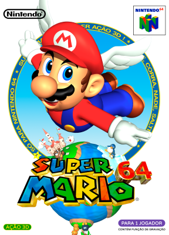
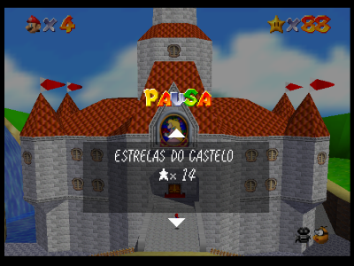
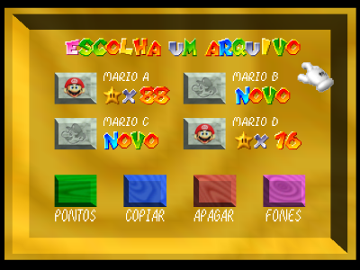
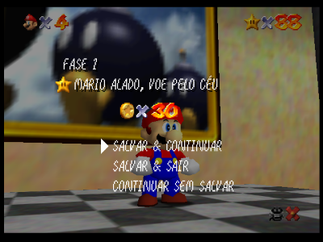

# Super Mario 64

## Informações sobre o jogo

| Tipo | Informação |
| ----------- | ----------- |
| Nome | [Super Mario 64](https://www.mobygames.com/game/3533/super-mario-64/) |
| Plataforma | [Nintendo 64](../../nintendo-64/) |
| Desenvolvedora | Nintendo |
| Distribuidora | Nintendo |
| Gênero | Ação / Plataforma |
| Data de Lançamento | 23/06/1996 |

## Informações sobre a tradução

| Tipo | Informação |
| ----------- | ----------- |
| Versão | 1.0 |
| Última versão | Sim |
| URL Youtube | [https://youtu.be/OOnbZWhB0Tg](https://youtu.be/OOnbZWhB0Tg) |
| Data de Lançamento | 20/05/2021 |
| Percentual traduzido | 100% |

## Autores

| Autor(a) | Papel na tradução |
| ----------- | ----------- |
| [BMatSantos](../../../autores/bmatsantos/) | Completo |
| [Kosmus](../../../autores/kosmus/) | Gráficos |
| [Vihh_Art](../../../autores/vihh_art/) | Dublagem |
| [Nathan](../../../autores/nathan/) | Revisão e Testes |
| [JinjoGuy](../../../autores/jinjoguy/) | Revisão e Testes |

## Informações sobre patching

| Aplicar o patch no arquivo | CRC32 Hash | MD5 Hash |
| ----------- | ----------- | ----------- |
| Super Mario 64 (USA) | 3CE60709 | 20B854B239203BAF6C961B850A4A51A2 |

## Páginas sobre a tradução

| URL | Oficial (publicado pelos autores) | Possuí link de download |
| ----------- | ----------- | ----------- |
| [https://www.romhacking.net/translations/6100/](https://www.romhacking.net/translations/6100/) | Sim | Sim |
| [https://www.romhacking.net.br/index.php?topic=1629](https://www.romhacking.net.br/index.php?topic=1629) | Sim | Sim, porém é necessário realizar login |
| [https://joao13traducoes.com/2021/05/n64-super-mario-64-traduzido-e-dublado-bmatsantos-kosmus-e-cia/](https://joao13traducoes.com/2021/05/n64-super-mario-64-traduzido-e-dublado-bmatsantos-kosmus-e-cia/) | Não | Sim, porém o arquivo ou página de download exige uma senha |

## Imagens da tradução

