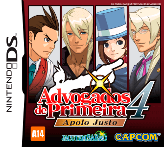
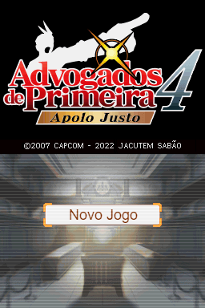
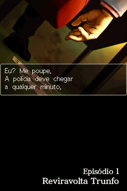
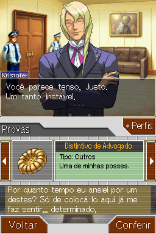
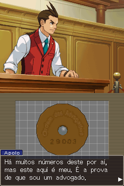
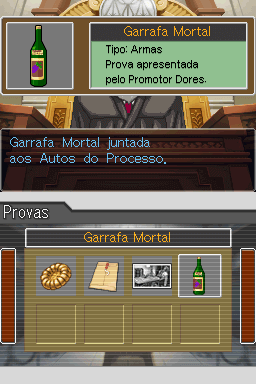
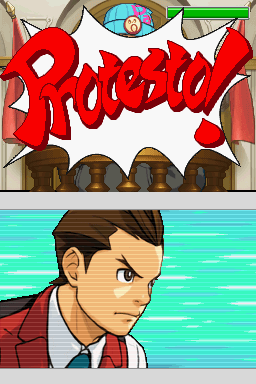
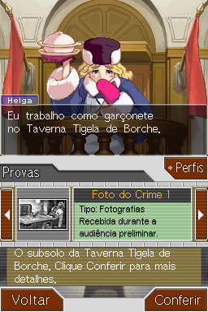
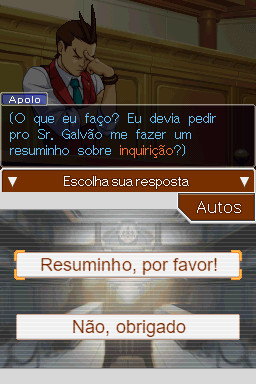

# Apollo Justice - Ace Attorney

## Informações sobre o jogo

| Tipo | Informação |
| ----------- | ----------- |
| Nome | Apollo Justice \- Ace Attorney |
| Plataforma | [Nintendo DS](../) |
| Desenvolvedora | Capcom |
| Distribuidora | Capcom |
| Gênero | Visual novel |
| Data de Lançamento | 12/04/2007 |

## Informações sobre a tradução

| Tipo | Informação |
| ----------- | ----------- |
| Versão | 1\.2 |
| Última versão | Sim |
| URL Youtube | https://www.youtube.com/watch?v=miHp4-a658I |
| Data de Lançamento | 30/09/2022 |
| Percentual traduzido | 100% |

## Autores

| Autor(a) | Papel na tradução |
| ----------- | ----------- |
| [DiegoHH](../../../autores/diegohh/) | Romhacking |
| [djmatheusito](../../../autores/djmatheusito/) | Romhacking, gráficos e testes |
| [Gamerulez](../../../autores/gamerulez/) | Completo |
| [Dant](../../../autores/dant/) | Romhacking |
| [Solid\_One](../../../autores/solid_one/) | Romhacking |
| [JinjoGuy](../../../autores/jinjoguy/) | Completo |
| [Sahgo](../../../autores/sahgo/) | Tradução, dublagem e testes |
| [Nathan](../../../autores/nathan/) | Tradução e revisão |
| [Dwlipey](../../../autores/dwlipey/) | Tradução e revisão |
| [StarberryMilk](../../../autores/starberrymilk/) | Tradução |
| [Gustavo](../../../autores/gustavo/) | Tradução |
| [Gigi](../../../autores/gigi/) | Tradução e revisão |
| [Mob](../../../autores/mob/) | Tradução e revisão |
| [Silv3r](../../../autores/silv3r/) | Tradução |
| [Venesios](../../../autores/venesios/) | Tradução |
| [Dudu Silva](../../../autores/dudu-silva/) | Tradução |
| [Jagohod](../../../autores/jagohod/) | Tradução |
| [BMatSantos](../../../autores/bmatsantos/) | Tradução e Gráficos |
| [Adachi](../../../autores/adachi/) | Revisão |
| [Mysteriozo](../../../autores/mysteriozo/) | Gráficos |
| [Foxy](../../../autores/foxy/) | Gráficos |
| [Thecontrool](../../../autores/thecontrool/) | Gráficos |
| [Kosmus](../../../autores/kosmus/) | Gráficos e revisão |
| [Kazuma](../../../autores/kazuma/) | Gráficos |
| [BMaG](../../../autores/bmag/) | Gráficos |
| [Pacheco](../../../autores/pacheco/) | Gráficos |
| [Guixz](../../../autores/guixz/) | Gráficos |
| [Gabriel Andrade](../../../autores/gabriel-andrade/) | Dublagem |
| [Artoriuslima](../../../autores/artoriuslima/) | Dublagem |
| [Pedro Albuquerque](../../../autores/pedro-albuquerque/) | Dublagem |
| [Eduardo Yamane](../../../autores/eduardo-yamane/) | Dublagem |
| [Pain](../../../autores/pain/) | Revisão |
| [Rn](../../../autores/rn/) | Revisão |
| [RetroGamer](../../../autores/retrogamer/) | Revisão |
| [Guiguiba](../../../autores/guiguiba/) | Gráficos e revisão |

## Grupos

* [Jacutem Sabão](../../../grupos/jacutem-sabao/)

## Informações sobre patching

| Aplicar o patch no arquivo | CRC32 Hash | MD5 Hash |
| ----------- | ----------- | ----------- |
| Apollo Justice \- Ace Attorney \(U\)\.nds | AD99478D | 5BF349BEE8A1121AF7D02D0D323BBA73 |

## Páginas sobre a tradução

| URL | Oficial (publicado pelos autores) | Possuí link de download |
| ----------- | ----------- | ----------- |
| [https://jacutemsabao.bitbucket.io/download.html](https://jacutemsabao.bitbucket.io/download.html) | Sim | Sim |
| [https://www.romhacking.net.br/index.php?topic=1721](https://www.romhacking.net.br/index.php?topic=1721) | Sim | Sim |
| [https://joao13traducoes.com/2022/03/nds-apollo-justice-ace-attorney-traduzido-e-dublado-jacutem-sabao/](https://joao13traducoes.com/2022/03/nds-apollo-justice-ace-attorney-traduzido-e-dublado-jacutem-sabao/) | Não | Sim, porém o arquivo ou página de download exige uma senha |

## Imagens da tradução

