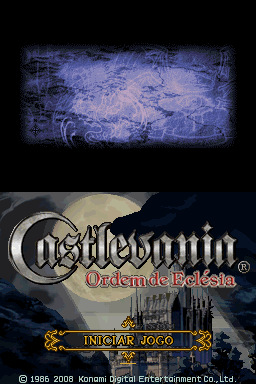
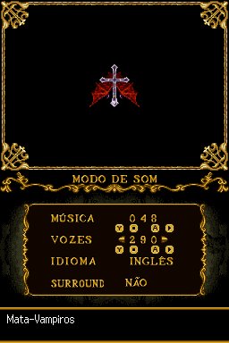
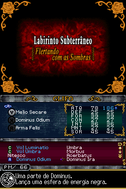
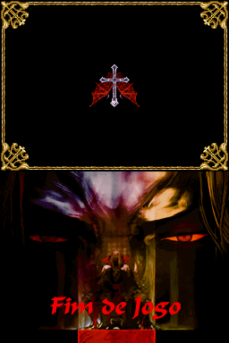
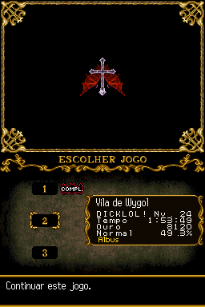
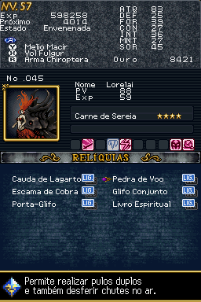
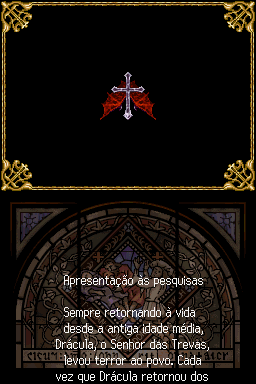
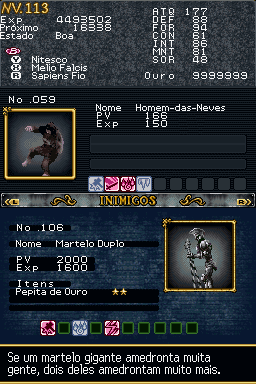

# Castlevania - Order of Ecclesia

## Informações sobre o jogo

| Tipo | Informação |
| ----------- | ----------- |
| Nome | Castlevania \- Order of Ecclesia |
| Plataforma | [Nintendo DS](../) |
| Desenvolvedora | Konami |
| Distribuidora | Konami |
| Gênero | Metroidvania |
| Data de Lançamento | 21/10/2007 |

## Informações sobre a tradução

| Tipo | Informação |
| ----------- | ----------- |
| Versão | 1\.0 |
| Última versão | Sim |
| Data de Lançamento | 29/07/2009 |
| Percentual traduzido | 95% |

## Autores

| Autor(a) | Papel na tradução |
| ----------- | ----------- |
| [Lanford](../../../autores/lanford/) | Tradução |
| [Hyllian](../../../autores/hyllian/) | Romhacking |
| [Solid\_One](../../../autores/solid_one/) | Gráficos e revisão |
| [NEODAN](../../../autores/neodan/) | Gráficos |
| [Aloprado](../../../autores/aloprado/) | Tradução |

## Grupos

* [Trans\-Center](../../../grupos/trans-center/)
* [PO\.B\.R\.E](../../../grupos/pobre/)

## Informações sobre patching

| Aplicar o patch no arquivo | CRC32 Hash | MD5 Hash |
| ----------- | ----------- | ----------- |
| Castlevania \- Order of Ecclesia \(U\)\.nds | 82A582A5 | EB14BE088C78CD33520473978F2C9D16 |

## Páginas sobre a tradução

| URL | Oficial (publicado pelos autores) | Possuí link de download |
| ----------- | ----------- | ----------- |
| [https://www.romhacking.net/translations/5317/](https://www.romhacking.net/translations/5317/) | Não | Sim |
| [https://romhackers.org/traducoes/portatil/nintendo-ds/castlevania-order-of-ecclesia-pobre-e-trans-center/](https://romhackers.org/traducoes/portatil/nintendo-ds/castlevania-order-of-ecclesia-pobre-e-trans-center/) | Não | Não |
| [https://joao13traducoes.com/2018/02/nds-castlevania-order-of-ecclesia-pobre-e-trans-center](https://joao13traducoes.com/2018/02/nds-castlevania-order-of-ecclesia-pobre-e-trans-center) | Não | Sim, porém o arquivo ou página de download exige uma senha |

## Imagens da tradução

