# Castlevania - Portrait of Ruin

## Informações sobre o jogo

| Tipo | Informação |
| ----------- | ----------- |
| Nome | Castlevania \- Portrait of Ruin |
| Plataforma | [Nintendo DS](../) |
| Desenvolvedora | Konami |
| Distribuidora | Konami |
| Gênero | Metroidvania |
| Data de Lançamento | 16/11/2006 |

## Informações sobre a tradução

| Tipo | Informação |
| ----------- | ----------- |
| Versão | 1\.0 |
| Última versão | Sim |
| Data de Lançamento | 21/01/2009 |
| Percentual traduzido | 95% |

## Autores

| Autor(a) | Papel na tradução |
| ----------- | ----------- |
| [Knirt](../../../autores/knirt/) | Tradução |
| [Hyllian](../../../autores/hyllian/) | Romhacking |
| [Solid\_One](../../../autores/solid_one/) | Tradução e Gráficos |
| [Joapeer](../../../autores/joapeer/) | Gráficos |
| [Fallen\_Soul](../../../autores/fallen_soul/) | Romhacking |

## Grupos

* [Trans\-Center](../../../grupos/trans-center/)
* [Monkey's Traduções](../../../grupos/monkeys-traducoes/)

## Informações sobre patching

| Aplicar o patch no arquivo | CRC32 Hash | MD5 Hash |
| ----------- | ----------- | ----------- |
| Castlevania \- Portrait of Ruin \(E\) \(M5\)\.nds | 772BA12A | 17A6618C3C7F5547D7C38FC04CB2666E |

## Páginas sobre a tradução

| URL | Oficial (publicado pelos autores) | Possuí link de download |
| ----------- | ----------- | ----------- |
| [https://www.romhacking.net/translations/5316/](https://www.romhacking.net/translations/5316/) | Não | Sim |
| [https://romhackers.org/traducoes/portatil/nintendo-ds/castlevania-portrait-of-ruin-monkeys-traducoes-e-trans-center/](https://romhackers.org/traducoes/portatil/nintendo-ds/castlevania-portrait-of-ruin-monkeys-traducoes-e-trans-center/) | Não | Não |

## Imagens da tradução

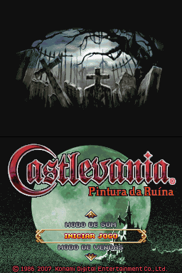
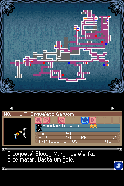
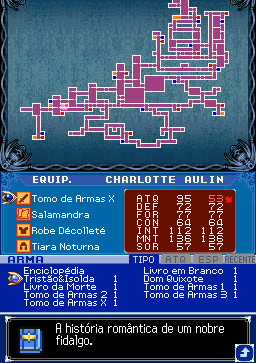
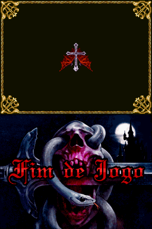
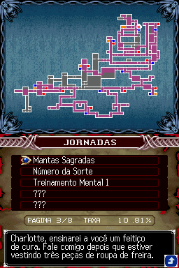
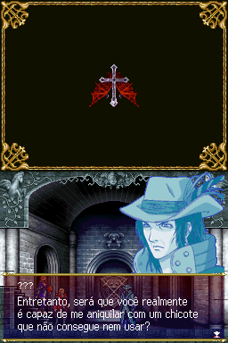
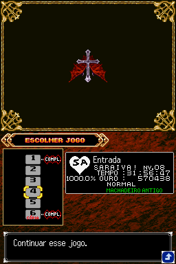
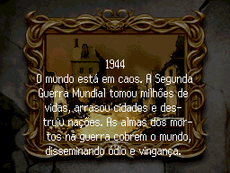
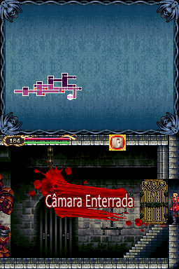
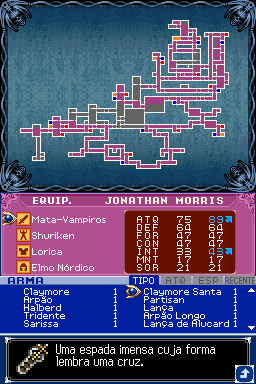
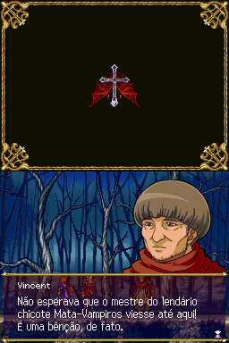
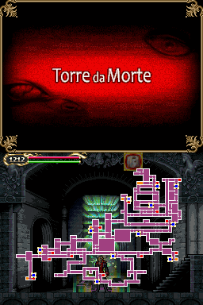