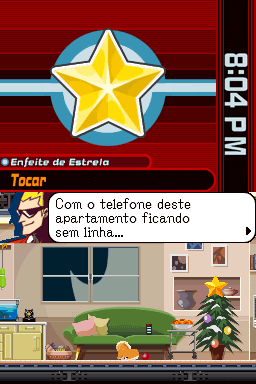

# Ghost Trick - Phantom Detective

## Informações sobre o jogo

| Tipo | Informação |
| ----------- | ----------- |
| Nome | Ghost Trick \- Phantom Detective |
| Plataforma | [Nintendo DS](../) |
| Desenvolvedora | Capcom |
| Distribuidora | Capcom |
| Gênero | Visual novel |
| Data de Lançamento | 19/06/2010 |

## Informações sobre a tradução

| Tipo | Informação |
| ----------- | ----------- |
| Versão | 1\.1 |
| Última versão | Sim |
| URL Youtube | https://www.youtube.com/watch?v=YyDYbkrjYvY |
| Data de Lançamento | 30/10/2022 |
| Percentual traduzido | 100% |

## Autores

| Autor(a) | Papel na tradução |
| ----------- | ----------- |
| [djmatheusito](../../../autores/djmatheusito/) | Romhacking |
| [JinjoGuy](../../../autores/jinjoguy/) | Completo |
| [Gamerulez](../../../autores/gamerulez/) | Completo |
| [Dant](../../../autores/dant/) | Romhacking |
| [Uão](../../../autores/uao/) | Gráficos |
| [BMatSantos](../../../autores/bmatsantos/) | Gráficos |
| [BMaG](../../../autores/bmag/) | Tradução e Gráficos |
| [Kosmus](../../../autores/kosmus/) | Gráficos |
| [Luco](../../../autores/luco/) | Tradução |
| [Nathan](../../../autores/nathan/) | Tradução e revisão |
| [Andra](../../../autores/andra/) | Tradução |
| [Geraldox](../../../autores/geraldox/) | Tradução |
| [DGShoe](../../../autores/dgshoe/) | Tradução |
| [Adachi](../../../autores/adachi/) | Tradução e revisão |
| [Dwlipey](../../../autores/dwlipey/) | Tradução |
| [Mob](../../../autores/mob/) | Tradução |
| [Tchinfsun](../../../autores/tchinfsun/) | Tradução |
| [Steve\_Doido](../../../autores/steve_doido/) | Tradução |
| [Ana Lee](../../../autores/ana-lee/) | Tradução |
| [Guardinha](../../../autores/guardinha/) | Revisão |
| [RetroGamer](../../../autores/retrogamer/) | Revisão |

## Grupos

* [Jacutem Sabão](../../../grupos/jacutem-sabao/)

## Informações sobre patching

| Aplicar o patch no arquivo | CRC32 Hash | MD5 Hash |
| ----------- | ----------- | ----------- |
| Ghost Trick \- Phantom Detective \(U\) \(M5\)\.nds | 5CD93FE5 | E61D75F376B0733B5479AE869F744855 |

## Páginas sobre a tradução

| URL | Oficial (publicado pelos autores) | Possuí link de download |
| ----------- | ----------- | ----------- |
| [https://www.romhacking.net.br/index.php?topic=1174](https://www.romhacking.net.br/index.php?topic=1174) | Sim | Sim |
| [https://jacutemsabao.bitbucket.io/download.html](https://jacutemsabao.bitbucket.io/download.html) | Sim | Sim |
| [https://www.romhacking.net.br/index.php?topic=1174](https://www.romhacking.net.br/index.php?topic=1174) | Não | Sim |
| [https://joao13traducoes.com/2022/10/nds-ghost-trick-phantom-detective-jacutem-sabao/](https://joao13traducoes.com/2022/10/nds-ghost-trick-phantom-detective-jacutem-sabao/) | Não | Sim, porém o arquivo ou página de download exige uma senha |

## Imagens da tradução

