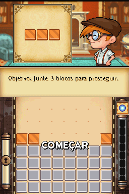
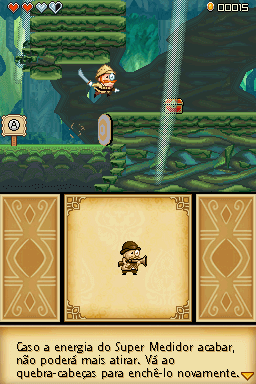

# Henry Hatsworth in The Puzzling Adventure

## Informações sobre o jogo

| Tipo | Informação |
| ----------- | ----------- |
| Nome | Henry Hatsworth in The Puzzling Adventure |
| Plataforma | [Nintendo DS](../) |
| Desenvolvedora | Electronic Arts (EA) |
| Distribuidora | Electronic Arts (EA) |
| Gênero | Puzzle |
| Data de Lançamento | 17/03/2009 |

## Informações sobre a tradução

| Tipo | Informação |
| ----------- | ----------- |
| Versão | 1\.0 |
| Última versão | Sim |
| Data de Lançamento | 04/08/2013 |
| Percentual traduzido | 99% |

## Autores

| Autor(a) | Papel na tradução |
| ----------- | ----------- |
| [Lobim](../../../autores/lobim/) | Completo |
| [Marvin Dalkiri](../../../autores/marvin-dalkiri/) | Romhacking |
| [DiegoHH](../../../autores/diegohh/) | Gráficos |
| [Ray](../../../autores/ray/) | Gráficos |
| [ZEMO](../../../autores/zemo/) | Revisão |

## Grupos

* [Monkey's Traduções](../../../grupos/monkeys-traducoes/)

## Informações sobre patching

| Aplicar o patch no arquivo | CRC32 Hash | MD5 Hash |
| ----------- | ----------- | ----------- |
| Henry Hatsworth in the Puzzling Adventure \(EU\)\.nds | 99112063 | 93D404688E546A9B78DCA6F21B703A45 |

## Páginas sobre a tradução

| URL | Oficial (publicado pelos autores) | Possuí link de download |
| ----------- | ----------- | ----------- |
| [https://www.romhacking.net/translations/3360/](https://www.romhacking.net/translations/3360/) | Não | Sim |
| [https://romhackers.org/traducoes/portatil/nintendo-ds/henry-hatsworth-in-the-puzzling-adventure-monkeys-traducoes/](https://romhackers.org/traducoes/portatil/nintendo-ds/henry-hatsworth-in-the-puzzling-adventure-monkeys-traducoes/) | Não | Não |
| [https://joao13traducoes.com/2018/02/nds-henry-hatsworth-in-puzzling-adventure-monkeys-traducoes](https://joao13traducoes.com/2018/02/nds-henry-hatsworth-in-puzzling-adventure-monkeys-traducoes) | Não | Sim, porém o arquivo ou página de download exige uma senha |

## Imagens da tradução

