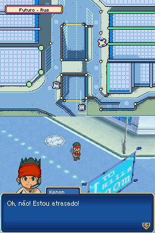
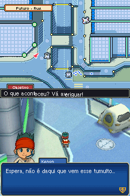

# Inazuma Eleven 3 - Sekai e no Chousen!! The Ogre

## Informações sobre o jogo

| Tipo | Informação |
| ----------- | ----------- |
| Nome | Inazuma Eleven 3 \- Sekai e no Chousen\!\! The Ogre |
| Plataforma | [Nintendo DS](../) |
| Desenvolvedora | Level-5 |
| Distribuidora | Level-5 |
| Gênero | RPG / Esportes |
| Data de Lançamento | 16/12/2010 |

## Informações sobre a tradução

| Tipo | Informação |
| ----------- | ----------- |
| Versão | 1\.2 |
| Última versão | Sim |
| URL Youtube | https://www.youtube.com/watch?v=HNUNl_3XPcc |
| Observação | No DeSmuME, a fonte fica um pouco bugada, você pode resolver isso indo em Config \-\&gt; 3D Settings e marcando a caixinha &quot;Enable TXT Hack&quot;\. Também é importante dizer que algumas partes não traduzidas estão em inglês\. |
| Data de Lançamento | 25/12/2022 |
| Percentual traduzido | 90% |

## Autores

| Autor(a) | Papel na tradução |
| ----------- | ----------- |
| [Davyzin](../../../autores/davyzin/) | Completo |
| [Kosmus](../../../autores/kosmus/) | Gráficos |
| [CyberLife](../../../autores/cyberlife/) | Revisão |

## Informações sobre patching

| Aplicar o patch no arquivo | CRC32 Hash | MD5 Hash |
| ----------- | ----------- | ----------- |
| Inazuma Eleven 3 \- Sekai heno Chousen The Ogre \(J\)\.nds | A9754AEA | DE2690E8035A695BB65334599AFFEB7C |

## Páginas sobre a tradução

| URL | Oficial (publicado pelos autores) | Possuí link de download |
| ----------- | ----------- | ----------- |
| [https://www.romhacking.net.br/index.php?topic=2028](https://www.romhacking.net.br/index.php?topic=2028) | Sim | Sim |
| [https://joao13traducoes.com/2022/01/nds-inazuma-eleven-3-sekai-e-no-chousen-the-ogre-cyberlife/](https://joao13traducoes.com/2022/01/nds-inazuma-eleven-3-sekai-e-no-chousen-the-ogre-cyberlife/) | Não | Sim, porém o arquivo ou página de download exige uma senha |

## Imagens da tradução

