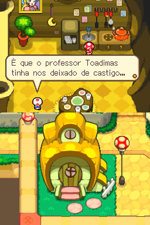
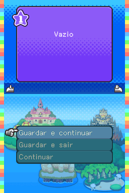
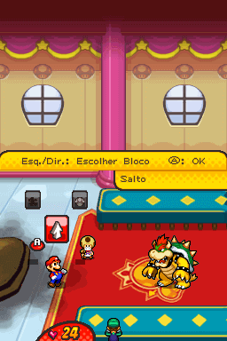
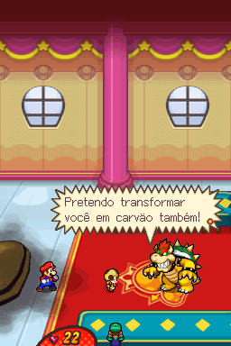

# Mario &amp; Luigi - Bowser Inside Story

## Informações sobre o jogo

| Tipo | Informação |
| ----------- | ----------- |
| Nome | Mario &amp; Luigi \- Bowser Inside Story |
| Plataforma | [Nintendo DS](../) |
| Desenvolvedora | AlphaDream Corporation |
| Distribuidora | Nintendo |
| Gênero | RPG |
| Data de Lançamento | 11/02/2009 |

## Informações sobre a tradução

| Tipo | Informação |
| ----------- | ----------- |
| Versão | 1\.0 |
| Última versão | Sim |
| URL Youtube | https://www.youtube.com/watch?v=hfEhCo5sBR8 |
| Observação | O jogo foi traduzido a partir do idioma espanhol\. Portanto, para ativar a tradução é necessário mudar o idioma no emulador ou no DS para Espanhol\. |
| Data de Lançamento | 11/10/2021 |
| Percentual traduzido | 80% |

## Autores

| Autor(a) | Papel na tradução |
| ----------- | ----------- |
| [SBraz Gamer](../../../autores/sbraz-gamer/) | Tradução |

## Informações sobre patching

| Aplicar o patch no arquivo | CRC32 Hash | MD5 Hash |
| ----------- | ----------- | ----------- |
| Mario &amp; Luigi \- Bowser's Inside Story \(E\) \(M5\)\.nds | 9C2F90A6 | 3C2334E0DEA72313D36B51A5418501F9 |

## Páginas sobre a tradução

| URL | Oficial (publicado pelos autores) | Possuí link de download |
| ----------- | ----------- | ----------- |
| [https://www.romhacking.net.br/index.php?topic=1971](https://www.romhacking.net.br/index.php?topic=1971) | Sim | Sim |
| [https://joao13traducoes.com/2021/10/nds-mario-luigi-bowser-inside-story-sbraz-gamer/](https://joao13traducoes.com/2021/10/nds-mario-luigi-bowser-inside-story-sbraz-gamer/) | Não | Sim, porém o arquivo ou página de download exige uma senha |

## Imagens da tradução

