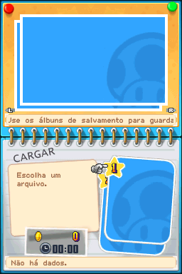
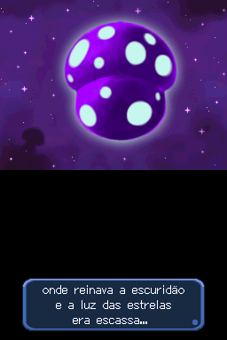
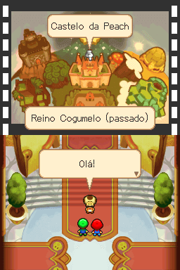
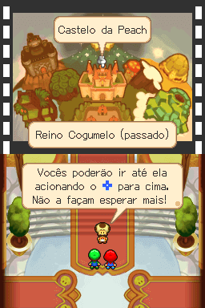
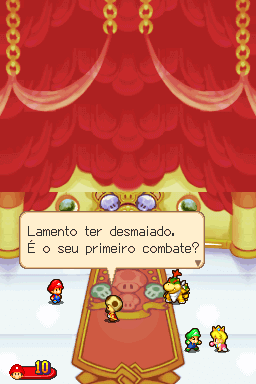
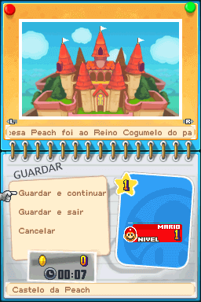

# Mario &amp; Luigi - Partners in Time

## Informações sobre o jogo

| Tipo | Informação |
| ----------- | ----------- |
| Nome | Mario &amp; Luigi \- Partners in Time |
| Plataforma | [Nintendo DS](../) |
| Desenvolvedora | AlphaDream Corporation |
| Distribuidora | Nintendo |
| Gênero | RPG / Turno |
| Data de Lançamento | 28/11/2005 |

## Informações sobre a tradução

| Tipo | Informação |
| ----------- | ----------- |
| Versão | 1\.0\.1 |
| Última versão | Sim |
| Data de Lançamento | 22/03/2021 |
| Percentual traduzido | 80% |

## Autores

| Autor(a) | Papel na tradução |
| ----------- | ----------- |
| [SBraz Gamer](../../../autores/sbraz-gamer/) | Tradução |

## Informações sobre patching

| Aplicar o patch no arquivo | CRC32 Hash | MD5 Hash |
| ----------- | ----------- | ----------- |
| Mario &amp; Luigi \- Partners in Time \(Europe\) \(En,Fr,De,Es,It\)\.nds | 3184FBC4 | F9E031C8D3AACEA6306BBAC41BF577F5 |

## Páginas sobre a tradução

| URL | Oficial (publicado pelos autores) | Possuí link de download |
| ----------- | ----------- | ----------- |
| [https://www.romhacking.net.br/index.php?topic=1797](https://www.romhacking.net.br/index.php?topic=1797) | Sim | Sim |
| [https://joao13traducoes.com/2021/03/nds-mario-luigi-partners-in-time-sbraz-gamer/](https://joao13traducoes.com/2021/03/nds-mario-luigi-partners-in-time-sbraz-gamer/) | Não | Sim, porém o arquivo ou página de download exige uma senha |

## Imagens da tradução

