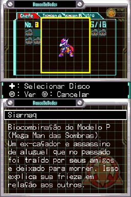
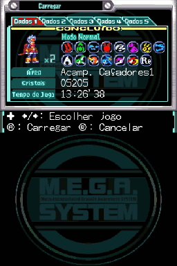
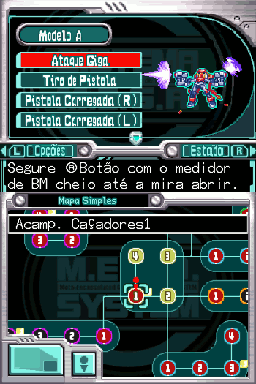
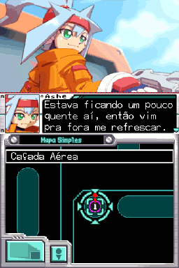
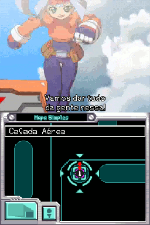
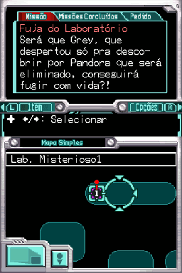
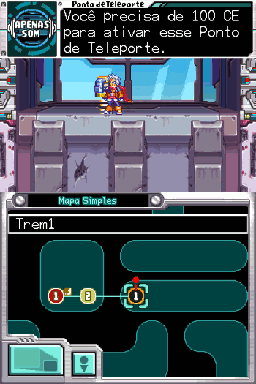

# Mega Man ZX Advent

## Informações sobre o jogo

| Tipo | Informação |
| ----------- | ----------- |
| Nome | Mega Man ZX Advent |
| Plataforma | [Nintendo DS](../) |
| Desenvolvedora | INTI CREATES |
| Distribuidora | Capcom |
| Gênero | Metroidvania |
| Data de Lançamento | 12/07/2007 |

## Informações sobre a tradução

| Tipo | Informação |
| ----------- | ----------- |
| Versão | 1\.0 |
| Última versão | Sim |
| Data de Lançamento | 20/12/2017 |
| Percentual traduzido | 90% |

## Autores

| Autor(a) | Papel na tradução |
| ----------- | ----------- |
| [Solid\_One](../../../autores/solid_one/) | Completo |
| [Maverick Blue Warrior](../../../autores/maverick-blue-warrior/) | Completo |
| [DiegoHH](../../../autores/diegohh/) | Romhacking |
| [Denim](../../../autores/denim/) | Romhacking |
| [Geo](../../../autores/geo/) | Revisão |

## Grupos

* [Trans\-Center](../../../grupos/trans-center/)
* [Monkey's Traduções](../../../grupos/monkeys-traducoes/)

## Informações sobre patching

| Aplicar o patch no arquivo | CRC32 Hash | MD5 Hash |
| ----------- | ----------- | ----------- |
| MegaMan ZX Advent \(U\)\.nds | 6CA425E5 | 596462F2976C1582FF45E88AAF3FA01B |

## Páginas sobre a tradução

| URL | Oficial (publicado pelos autores) | Possuí link de download |
| ----------- | ----------- | ----------- |
| [https://www.romhacking.net.br/index.php?topic=224](https://www.romhacking.net.br/index.php?topic=224) | Sim | Sim |
| [https://www.romhacking.net/translations/5233/](https://www.romhacking.net/translations/5233/) | Não | Sim |
| [https://romhackers.org/traducoes/portatil/nintendo-ds/mega-man-zx-advent-trans-center-e-monkeys-traducoes/](https://romhackers.org/traducoes/portatil/nintendo-ds/mega-man-zx-advent-trans-center-e-monkeys-traducoes/) | Não | Não |
| [https://joao13traducoes.com/2018/02/nds-mega-man-zx-advent-trans-center-e-monkeys-traducoes](https://joao13traducoes.com/2018/02/nds-mega-man-zx-advent-trans-center-e-monkeys-traducoes) | Não | Sim, porém o arquivo ou página de download exige uma senha |

## Imagens da tradução

