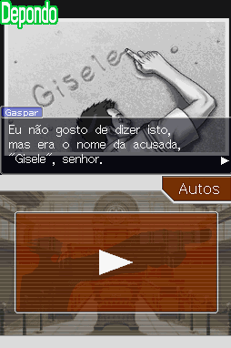

# Phoenix Wright - Ace Attorney - Justice for All

## Informações sobre o jogo

| Tipo | Informação |
| ----------- | ----------- |
| Nome | Phoenix Wright \- Ace Attorney \- Justice for All |
| Plataforma | [Nintendo DS](../) |
| Desenvolvedora | Capcom |
| Distribuidora | Capcom |
| Gênero | Visual novel |
| Data de Lançamento | 26/10/2006 |

## Informações sobre a tradução

| Tipo | Informação |
| ----------- | ----------- |
| Versão | 1\.111 |
| Última versão | Sim |
| URL Youtube | https://www.youtube.com/watch?v=veI6NiR9TSI |
| Data de Lançamento | 01/09/2020 |
| Percentual traduzido | 100% |

## Autores

| Autor(a) | Papel na tradução |
| ----------- | ----------- |
| [Solid\_One](../../../autores/solid_one/) | Completo |
| [Gamerulez](../../../autores/gamerulez/) | Completo |
| [Dant](../../../autores/dant/) | Romhacking e Gráficos |
| [DiegoHH](../../../autores/diegohh/) | Romhacking |
| [djmatheusito](../../../autores/djmatheusito/) | Romhacking e Gráficos |
| [Sahgo](../../../autores/sahgo/) | Tradução |
| [Rafael Andrade](../../../autores/rafael-andrade/) | Tradução e revisão |
| [Jagohod](../../../autores/jagohod/) | Tradução |
| [Katodelumo](../../../autores/katodelumo/) | Tradução |
| [Gustavo](../../../autores/gustavo/) | Tradução |
| [Kaid](../../../autores/kaid/) | Tradução |
| [Naoya](../../../autores/naoya/) | Tradução e Gráficos |
| [S\.O\.](../../../autores/so/) | Gráficos |
| [EmuPlays](../../../autores/emuplays/) | Gráficos |
| [Sigaki](../../../autores/sigaki/) | Dublagem |
| [Gabriel Andrade](../../../autores/gabriel-andrade/) | Dublagem |
| [Eduardo Yamane](../../../autores/eduardo-yamane/) | Dublagem |
| [Juh Tairin](../../../autores/juh-tairin/) | Dublagem |

## Grupos

* [Jacutem Sabão](../../../grupos/jacutem-sabao/)

## Informações sobre patching

| Aplicar o patch no arquivo | CRC32 Hash | MD5 Hash |
| ----------- | ----------- | ----------- |
| Phoenix Wright \- Ace Attorney \- Justice for All \(USA\)\.nds | ED50C3E6 | 7CE988F799C18FDEE49D09DA942FC341 |

## Páginas sobre a tradução

| URL | Oficial (publicado pelos autores) | Possuí link de download |
| ----------- | ----------- | ----------- |
| [https://jacutemsabao.bitbucket.io/download.html](https://jacutemsabao.bitbucket.io/download.html) | Sim | Sim |
| [https://www.romhacking.net/translations/5382/](https://www.romhacking.net/translations/5382/) | Não | Sim, porém é uma versão antiga |
| [https://joao13traducoes.com/2019/03/nds-phoenix-wright-ace-attorney-justice-for-all-traduzido-e-dublado-jacutem-sabao/](https://joao13traducoes.com/2019/03/nds-phoenix-wright-ace-attorney-justice-for-all-traduzido-e-dublado-jacutem-sabao/) | Não | Sim, porém o arquivo ou página de download exige uma senha |

## Imagens da tradução

