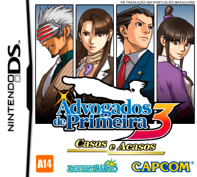
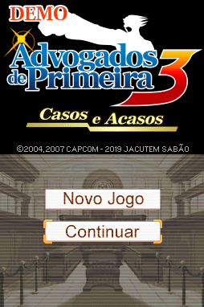
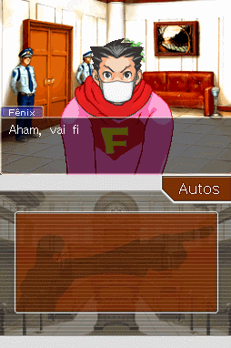
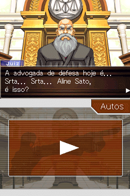
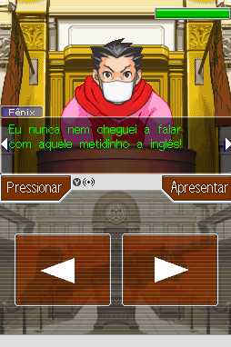
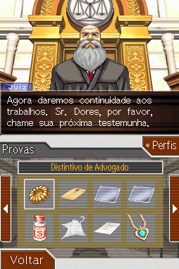
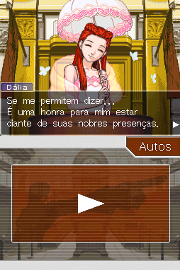

# Phoenix Wright - Ace Attorney - Trials And Tribulations

## Informações sobre o jogo

| Tipo | Informação |
| ----------- | ----------- |
| Nome | Phoenix Wright \- Ace Attorney \- Trials And Tribulations |
| Plataforma | [Nintendo DS](../) |
| Desenvolvedora | Capcom |
| Distribuidora | Capcom |
| Gênero | Visual novel |
| Data de Lançamento | 23/10/2007 |

## Informações sobre a tradução

| Tipo | Informação |
| ----------- | ----------- |
| Versão | 1\.0 |
| Última versão | Sim |
| Data de Lançamento | 01/09/2020 |
| Percentual traduzido | 100% |

## Autores

| Autor(a) | Papel na tradução |
| ----------- | ----------- |
| [Solid\_One](../../../autores/solid_one/) | Completo |
| [Gamerulez](../../../autores/gamerulez/) | Completo |
| [Dant](../../../autores/dant/) | Romhacking e Gráficos |
| [DiegoHH](../../../autores/diegohh/) | Romhacking |
| [djmatheusito](../../../autores/djmatheusito/) | Romhacking e Gráficos |
| [Sahgo](../../../autores/sahgo/) | Tradução e revisão |
| [Rafael Andrade](../../../autores/rafael-andrade/) | Tradução e revisão |
| [Gustavo Jagohod](../../../autores/gustavo-jagohod/) | Tradução |
| [Katodelumo](../../../autores/katodelumo/) | Tradução |
| [Kaid](../../../autores/kaid/) | Tradução |
| [Naoya](../../../autores/naoya/) | Tradução e Gráficos |
| [LiferFiberInfused Joker](../../../autores/liferfiberinfused-joker/) | Tradução |
| [BlueFairy](../../../autores/bluefairy/) | Tradução |
| [Gigi](../../../autores/gigi/) | Tradução |
| [Senn](../../../autores/senn/) | Tradução e Gráficos |
| [Zerneas](../../../autores/zerneas/) | Tradução |
| [Lucas](../../../autores/lucas/) | Tradução |
| [Mjay](../../../autores/mjay/) | Tradução |
| [S\.O\.](../../../autores/so/) | Gráficos e revisão |
| [Cronus](../../../autores/cronus/) | Revisão |
| [Yuuki](../../../autores/yuuki/) | Revisão |
| [Mob](../../../autores/mob/) | Revisão |
| [Dwlipey](../../../autores/dwlipey/) | Revisão |
| [Flame Gavin](../../../autores/flame-gavin/) | Revisão |
| [BMatSantos](../../../autores/bmatsantos/) | Gráficos e revisão |
| [Kosmus](../../../autores/kosmus/) | Gráficos |
| [ALX](../../../autores/alx/) | Gráficos |
| [EmuPlays](../../../autores/emuplays/) | Gráficos |
| [Sigaki](../../../autores/sigaki/) | Dublagem |
| [Gabriel Andrade](../../../autores/gabriel-andrade/) | Dublagem |
| [Eduardo Yamane](../../../autores/eduardo-yamane/) | Dublagem |
| [Juh Tairin](../../../autores/juh-tairin/) | Dublagem |
| [Zizibs](../../../autores/zizibs/) | Dublagem |

## Grupos

* [Jacutem Sabão](../../../grupos/jacutem-sabao/)

## Informações sobre patching

| Aplicar o patch no arquivo | CRC32 Hash | MD5 Hash |
| ----------- | ----------- | ----------- |
| Phoenix Wright \- Ace Attorney \- Trials and Tribulations \(U\)\.nds | 54505BD8 | 95A45440731C1055063B77F3CD958099 |

## Páginas sobre a tradução

| URL | Oficial (publicado pelos autores) | Possuí link de download |
| ----------- | ----------- | ----------- |
| [https://jacutemsabao.bitbucket.io/download.html](https://jacutemsabao.bitbucket.io/download.html) | Sim | Sim |
| [https://www.romhacking.net.br/index.php?topic=1025](https://www.romhacking.net.br/index.php?topic=1025) | Sim | Sim |
| [https://joao13traducoes.com/2020/02/nds-phoenix-wright-ace-attorney-trials-and-tribulations-traduzido-e-dublado-jacutem-sabao/](https://joao13traducoes.com/2020/02/nds-phoenix-wright-ace-attorney-trials-and-tribulations-traduzido-e-dublado-jacutem-sabao/) | Não | Sim, porém o arquivo ou página de download exige uma senha |

## Imagens da tradução

