# Phoenix Wright - Ace Attorney

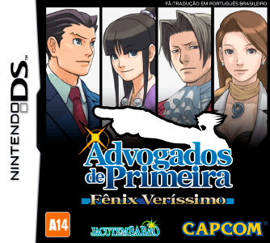

## Informações sobre o jogo

| Tipo | Informação |
| ----------- | ----------- |
| Nome | Phoenix Wright \- Ace Attorney |
| Plataforma | [Nintendo DS](../) |
| Desenvolvedora | Capcom |
| Distribuidora | Capcom |
| Gênero | Visual novel |
| Data de Lançamento | 15/09/2005 |

## Informações sobre a tradução

| Tipo | Informação |
| ----------- | ----------- |
| Versão | 1\.1 |
| Última versão | Sim |
| URL Youtube | https://www.youtube.com/watch?v=d5tC-fa8H7Y |
| Data de Lançamento | 10/03/2019 |
| Percentual traduzido | 100% |

## Autores

| Autor(a) | Papel na tradução |
| ----------- | ----------- |
| [Solid\_One](../../../autores/solid_one/) | Completo |
| [djmatheusito](../../../autores/djmatheusito/) | Completo |
| [DiegoHH](../../../autores/diegohh/) | Romhacking |
| [Gamerulez](../../../autores/gamerulez/) | Tradução e revisão |
| [Sahgo](../../../autores/sahgo/) | Tradução e revisão |
| [Magalicia](../../../autores/magalicia/) | Tradução e revisão |
| [BMatSantos](../../../autores/bmatsantos/) | Tradução e Gráficos |
| [Sigaki](../../../autores/sigaki/) | Tradução e dublagem |
| [Sorinha Phantasie](../../../autores/sorinha-phantasie/) | Tradução |
| [Cronus](../../../autores/cronus/) | Tradução |
| [nickhirano](../../../autores/nickhirano/) | Tradução e revisão |
| [Joker](../../../autores/joker/) | Tradução |
| [Binário](../../../autores/binario/) | Tradução |
| [Rafael Andrade](../../../autores/rafael-andrade/) | Revisão |
| [Giovany](../../../autores/giovany/) | Revisão |
| [Kit](../../../autores/kit/) | Revisão |
| [Sliter](../../../autores/sliter/) | Gráficos |
| [EmuPlays](../../../autores/emuplays/) | Gráficos |
| [Tanekoshima](../../../autores/tanekoshima/) | Dublagem |
| [Gabriel Andrade](../../../autores/gabriel-andrade/) | Dublagem |
| [Eduardo Yamane](../../../autores/eduardo-yamane/) | Dublagem |

## Grupos

* [Jacutem Sabão](../../../grupos/jacutem-sabao/)

## Informações sobre patching

| Aplicar o patch no arquivo | CRC32 Hash | MD5 Hash |
| ----------- | ----------- | ----------- |
| Phoenix Wright \- Ace Attorney \(U\)\.nds | BE5FB8D8 | 6580F4F45F6378A08914A7784F93E7FE |

## Páginas sobre a tradução

| URL | Oficial (publicado pelos autores) | Possuí link de download |
| ----------- | ----------- | ----------- |
| [https://www.romhacking.net.br/index.php?topic=427](https://www.romhacking.net.br/index.php?topic=427) | Sim | Sim |
| [https://jacutemsabao.bitbucket.io/download.html](https://jacutemsabao.bitbucket.io/download.html) | Sim | Sim |
| [https://www.romhacking.net/translations/5320/](https://www.romhacking.net/translations/5320/) | Não | Sim |
| [https://romhackers.org/traducoes/portatil/nintendo-ds/phoenix-wright-ace-attorney-jacutem-sabao/](https://romhackers.org/traducoes/portatil/nintendo-ds/phoenix-wright-ace-attorney-jacutem-sabao/) | Não | Não |
| [https://joao13traducoes.com/2018/07/nds-phoenix-wright-ace-attorney-jacutem-sabao/](https://joao13traducoes.com/2018/07/nds-phoenix-wright-ace-attorney-jacutem-sabao/) | Não | Sim, porém o arquivo ou página de download exige uma senha |

## Imagens da tradução

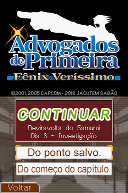
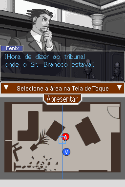
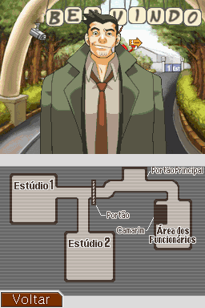
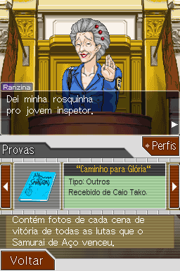
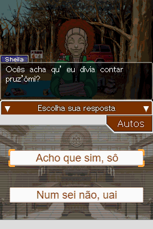
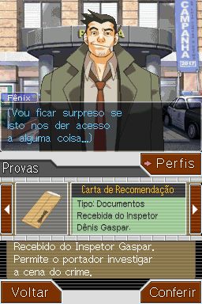
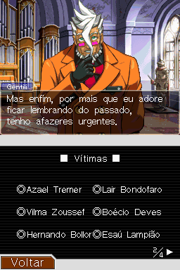
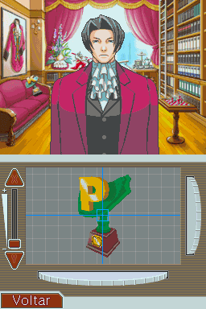
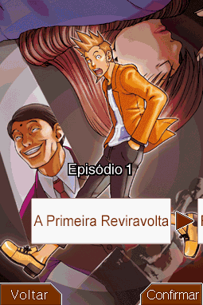
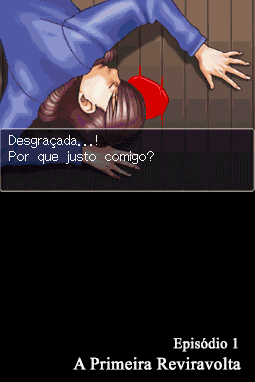
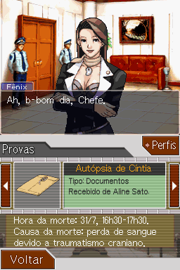
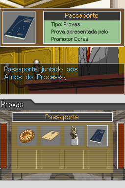
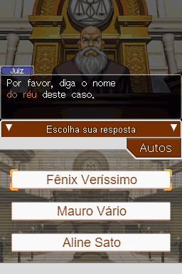
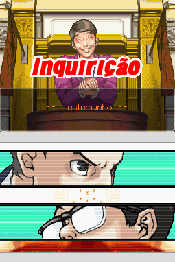
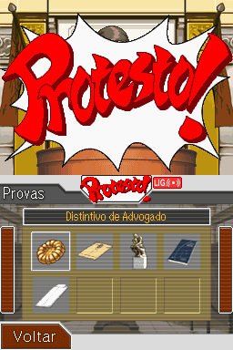
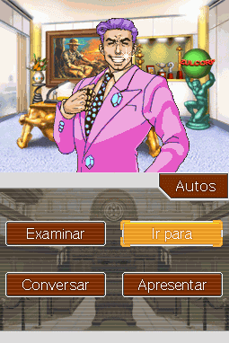