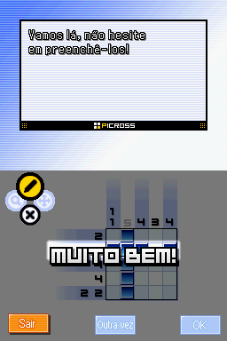

# Picross DS

## Informações sobre o jogo

| Tipo | Informação |
| ----------- | ----------- |
| Nome | Picross DS |
| Plataforma | [Nintendo DS](../) |
| Desenvolvedora | Jupiter |
| Distribuidora | Nintendo |
| Gênero | Puzzle |
| Data de Lançamento | 21/01/2007 |

## Informações sobre a tradução

| Tipo | Informação |
| ----------- | ----------- |
| Versão | 1\.0 |
| Última versão | Sim |
| Data de Lançamento | 06/06/2020 |
| Percentual traduzido | 99% |

## Autores

| Autor(a) | Papel na tradução |
| ----------- | ----------- |
| [Lobim](../../../autores/lobim/) | Completo |
| [Marvin Dalkiri](../../../autores/marvin-dalkiri/) | Romhacking |
| [DiegoHH](../../../autores/diegohh/) | Romhacking |
| [Gambas](../../../autores/gambas/) | Gráficos |
| [Killer\_Skull](../../../autores/killer_skull/) | Gráficos |
| [Kmikz](../../../autores/kmikz/) | Gráficos |
| [Lanford](../../../autores/lanford/) | Gráficos |
| [Solid\_One](../../../autores/solid_one/) | Gráficos |
| [ZEMO](../../../autores/zemo/) | Revisão |
| [Edilson](../../../autores/edilson/) | Revisão |

## Informações sobre patching

| Aplicar o patch no arquivo | CRC32 Hash | MD5 Hash |
| ----------- | ----------- | ----------- |
| Picross DS \(U\)\.nds | 35004805 | A980ADB92B4BBDA7784CDF960ADA8826 |

## Páginas sobre a tradução

| URL | Oficial (publicado pelos autores) | Possuí link de download |
| ----------- | ----------- | ----------- |
| [https://www.romhacking.net/translations/5579/](https://www.romhacking.net/translations/5579/) | Sim | Sim |
| [https://www.romhacking.net.br/index.php?topic=1455](https://www.romhacking.net.br/index.php?topic=1455) | Sim | Sim, porém é necessário realizar login |
| [https://romhackers.org/traducoes/portatil/nintendo-ds/picross-ds-lobim/](https://romhackers.org/traducoes/portatil/nintendo-ds/picross-ds-lobim/) | Não | Não |
| [https://joao13traducoes.com/2020/06/nds-picross-ds-monkeys-traducoes/](https://joao13traducoes.com/2020/06/nds-picross-ds-monkeys-traducoes/) | Não | Sim, porém o arquivo ou página de download exige uma senha |

## Imagens da tradução

