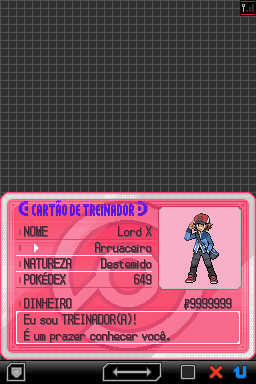
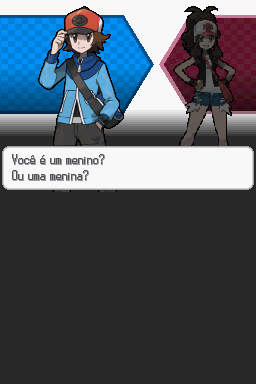
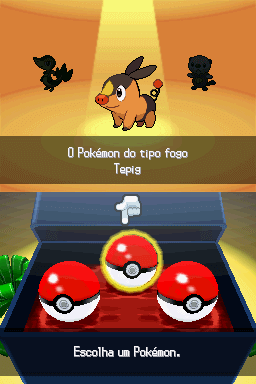
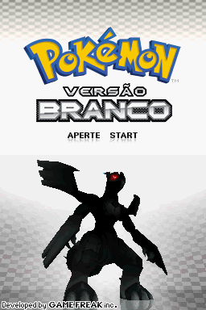
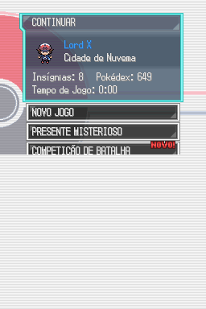
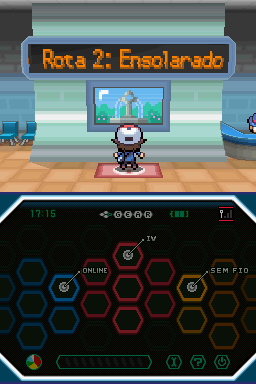
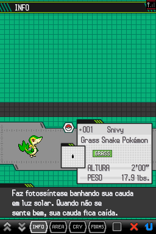
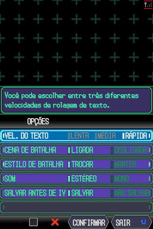
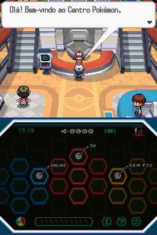
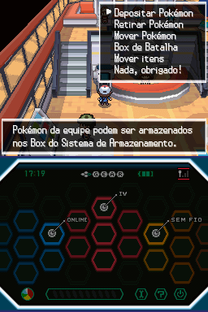

# Pokémon - Black Version

## Informações sobre o jogo

| Tipo | Informação |
| ----------- | ----------- |
| Nome | Pokémon \- Black Version |
| Plataforma | [Nintendo DS](../) |
| Desenvolvedora | Game Freak |
| Distribuidora | Nintendo |
| Gênero | RPG |
| Data de Lançamento | 18/09/2010 |

## Informações sobre a tradução

| Tipo | Informação |
| ----------- | ----------- |
| Versão | 1\.0 |
| Última versão | Sim |
| Data de Lançamento | 15/01/2023 |
| Percentual traduzido | None% |

## Autores

| Autor(a) | Papel na tradução |
| ----------- | ----------- |
| [Shokai](../../../autores/shokai/) | Tradução |
| [Gui96](../../../autores/gui96/) | Tradução |
| [Darkra](../../../autores/darkra/) | Tradução |
| [Kamikaze](../../../autores/kamikaze/) | Tradução |
| [JoeMeira](../../../autores/joemeira/) | Tradução |
| [Hareon](../../../autores/hareon/) | Revisão |
| [FiLLiP](../../../autores/fillip/) | Revisão |
| [Jubs](../../../autores/jubs/) | Revisão |
| [Hentai\-san](../../../autores/hentai-san/) | Revisão |
| [Kosmus](../../../autores/kosmus/) | Gráficos |

## Grupos

* [Elite dos Quatro Traduções](../../../grupos/elite-dos-quatro-traducoes/)

## Informações sobre patching

| Aplicar o patch no arquivo | CRC32 Hash | MD5 Hash |
| ----------- | ----------- | ----------- |
| Pokemon \- Black Version \(DSi Enhanced\) \(USA\) \(E\)\.nds | E2BEE619 | F45FD94BB761721E30BD3A0A4FDE124A |

## Páginas sobre a tradução

| URL | Oficial (publicado pelos autores) | Possuí link de download |
| ----------- | ----------- | ----------- |
| [https://www.e4t.com.br/downloads/pb/pokemon-versao-preta/](https://www.e4t.com.br/downloads/pb/pokemon-versao-preta/) | Sim | Sim |
| [https://joao13traducoes.com/2022/03/nds-pokemon-black-version-e4t/](https://joao13traducoes.com/2022/03/nds-pokemon-black-version-e4t/) | Não | Sim, porém o arquivo ou página de download exige uma senha |

## Imagens da tradução

