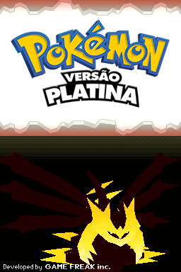
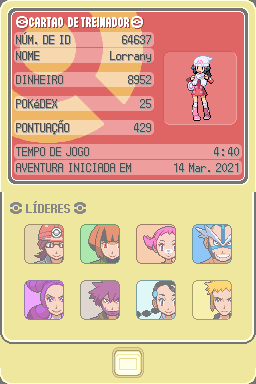
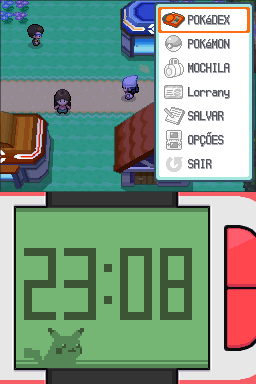
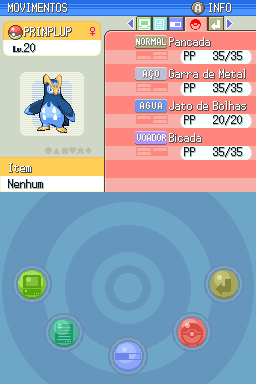
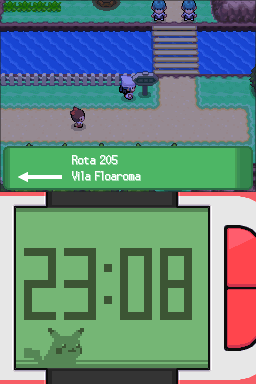
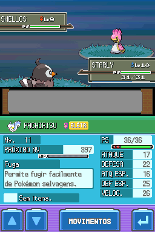
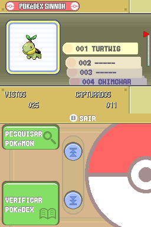
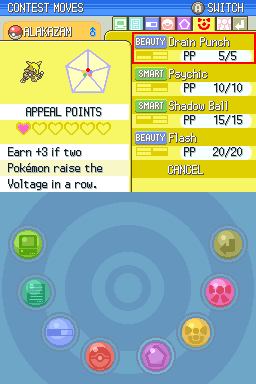

# Pokémon Platinum

## Informações sobre o jogo

| Tipo | Informação |
| ----------- | ----------- |
| Nome | Pokémon Platinum |
| Plataforma | [Nintendo DS](../) |
| Desenvolvedora | Game Freak |
| Distribuidora | Nintendo |
| Gênero | RPG |
| Data de Lançamento | 22/03/2009 |

## Informações sobre a tradução

| Tipo | Informação |
| ----------- | ----------- |
| Versão | 1\.2\.0 |
| Última versão | Sim |
| Data de Lançamento | 07/11/2021 |
| Percentual traduzido | 100% |

## Autores

| Autor(a) | Papel na tradução |
| ----------- | ----------- |
| [Maldonny](../../../autores/maldonny/) | Completo |
| [Kosmus](../../../autores/kosmus/) | Gráficos |
| [Shokai](../../../autores/shokai/) | Gráficos |

## Grupos

* [Elite dos Quatro Traduções](../../../grupos/elite-dos-quatro-traducoes/)

## Informações sobre patching

| Aplicar o patch no arquivo | CRC32 Hash | MD5 Hash |
| ----------- | ----------- | ----------- |
| Pokemon Platinum Version \(US\) \(XenoPhobia\)\.nds | 1D8A5220 | F8905424F7D8AEA299C51EC7580B33D8 |

## Páginas sobre a tradução

| URL | Oficial (publicado pelos autores) | Possuí link de download |
| ----------- | ----------- | ----------- |
| [https://www.e4t.com.br/downloads/pokemon-platina/](https://www.e4t.com.br/downloads/pokemon-platina/) | Sim | Sim |
| [https://www.romhacking.net.br/index.php?topic=1794](https://www.romhacking.net.br/index.php?topic=1794) | Sim | Sim |
| [https://romhackers.org/traducoes/portatil/nintendo-ds/pokemon-platinum-maldonny-e-sidneyp1/](https://romhackers.org/traducoes/portatil/nintendo-ds/pokemon-platinum-maldonny-e-sidneyp1/) | Não | Não |
| [https://joao13traducoes.com/2021/11/nds-pokemon-platinum-version-e4t/](https://joao13traducoes.com/2021/11/nds-pokemon-platinum-version-e4t/) | Não | Sim, porém o arquivo ou página de download exige uma senha |

## Imagens da tradução

