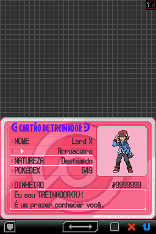
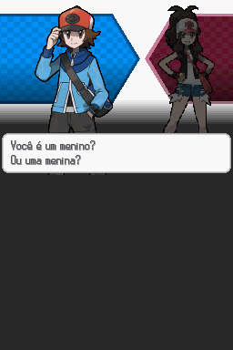
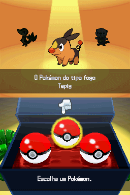
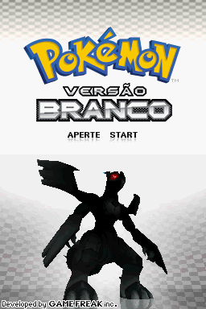
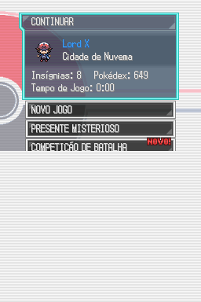
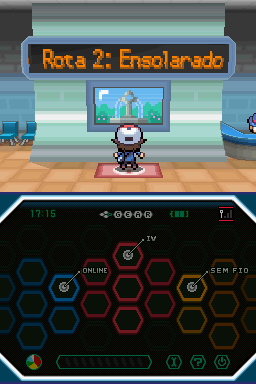
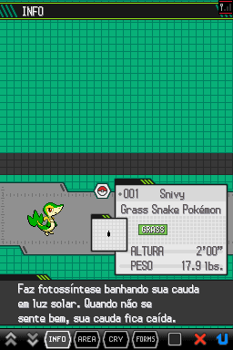
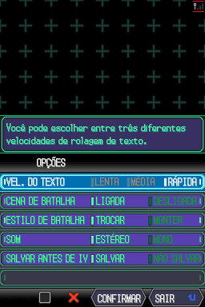
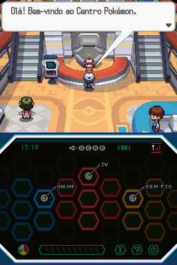
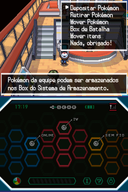

# Pokémon - White Version

## Informações sobre o jogo

| Tipo | Informação |
| ----------- | ----------- |
| Nome | Pokémon \- White Version |
| Plataforma | [Nintendo DS](../) |
| Desenvolvedora | Game Freak |
| Distribuidora | Nintendo |
| Gênero | RPG |
| Data de Lançamento | 18/09/2010 |

## Informações sobre a tradução

| Tipo | Informação |
| ----------- | ----------- |
| Versão | 1\.0 |
| Última versão | Sim |
| Licença | CC BY-NC-SA 4.0 |
| Data de Lançamento | 13/01/2023 |
| Percentual traduzido | None% |

## Autores

| Autor(a) | Papel na tradução |
| ----------- | ----------- |
| [Shokai](../../../autores/shokai/) | Tradução |
| [Gui96](../../../autores/gui96/) | Tradução |
| [Darkra](../../../autores/darkra/) | Tradução |
| [Kamikaze](../../../autores/kamikaze/) | Tradução |
| [JoeMeira](../../../autores/joemeira/) | Tradução |
| [Hareon](../../../autores/hareon/) | Revisão |
| [FiLLiP](../../../autores/fillip/) | Revisão |
| [Jubs](../../../autores/jubs/) | Revisão |
| [Hentai\-san](../../../autores/hentai-san/) | Revisão |
| [Kosmus](../../../autores/kosmus/) | Gráficos |

## Grupos

* [Elite dos Quatro Traduções](../../../grupos/elite-dos-quatro-traducoes/)

## Informações sobre patching

| Aplicar o patch no arquivo | CRC32 Hash | MD5 Hash |
| ----------- | ----------- | ----------- |
| Pokemon \- White Version \(DSi Enhanced\) \(USA\) \(E\)\.nds | EDCD5161 | 8DFEF9A099E1269AF5C1FCF9D7736A11 |

## Páginas sobre a tradução

| URL | Oficial (publicado pelos autores) | Possuí link de download |
| ----------- | ----------- | ----------- |
| [https://www.e4t.com.br/downloads/pb/pokemon-versao-branca/](https://www.e4t.com.br/downloads/pb/pokemon-versao-branca/) | Sim | Sim |
| [https://romhackers.org/traducoes/portatil/nintendo-ds/pokemon-white-version-shokai-e-grande-elenco/](https://romhackers.org/traducoes/portatil/nintendo-ds/pokemon-white-version-shokai-e-grande-elenco/) | Não | Não |
| [https://joao13traducoes.com/2023/01/nds-pokemon-white-version-e4t/](https://joao13traducoes.com/2023/01/nds-pokemon-white-version-e4t/) | Não | Sim, porém o arquivo ou página de download exige uma senha |

## Imagens da tradução

