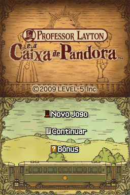
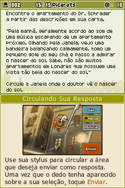
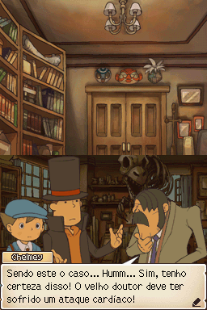
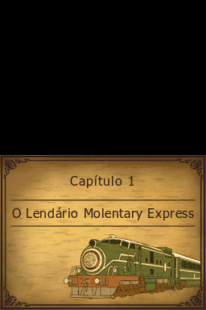

# Professor Layton and Pandora's Box

## Informações sobre o jogo

| Tipo | Informação |
| ----------- | ----------- |
| Nome | Professor Layton and Pandora's Box |
| Plataforma | [Nintendo DS](../) |
| Desenvolvedora | Level-5 |
| Distribuidora | Nintendo |
| Gênero | Puzzle |
| Data de Lançamento | 25/09/2009 |

## Informações sobre a tradução

| Tipo | Informação |
| ----------- | ----------- |
| Versão | 1\.0 |
| Última versão | Sim |
| Licença | CC BY-NC-ND 3.0 |
| URL Youtube | https://www.youtube.com/watch?v=0dLshyXk4HA |
| Observação | \* As fontes usadas na tradução das imagens são fiéis às originais\.
   \* Os enigmas semanais foram desbloqueados através de ASM Hacking, não sendo mais necessário &quot;baixá\-los&quot;\.
   \* A porta oculta do jogo foi desbloqueada através de ASM Hacking, onde qualquer código inserido será validado\. |
| Data de Lançamento | 28/12/2020 |
| Percentual traduzido | 100% |

## Autores

| Autor(a) | Papel na tradução |
| ----------- | ----------- |
| [DiegoHH](../../../autores/diegohh/) | Completo |
| [Solid\_One](../../../autores/solid_one/) | Tradução e Gráficos |
| [Sahgo](../../../autores/sahgo/) | Tradução |
| [Steve\_Doido](../../../autores/steve_doido/) | Tradução |
| [Gamerulez](../../../autores/gamerulez/) | Tradução |
| [Magall](../../../autores/magall/) | Tradução |
| [Shagohod](../../../autores/shagohod/) | Tradução |

## Grupos

* [Monkey's Traduções](../../../grupos/monkeys-traducoes/)
* [Jacutem Sabão](../../../grupos/jacutem-sabao/)

## Informações sobre patching

| Aplicar o patch no arquivo | CRC32 Hash | MD5 Hash |
| ----------- | ----------- | ----------- |
| Professor Layton and Pandora's Box \(EU\)\(BAHAMUT\)\.nds | DF132837 | 622727D535B4291144137D7DC485F938 |

## Páginas sobre a tradução

| URL | Oficial (publicado pelos autores) | Possuí link de download |
| ----------- | ----------- | ----------- |
| [https://jacutemsabao.bitbucket.io/download.html](https://jacutemsabao.bitbucket.io/download.html) | Sim | Sim |
| [https://www.romhacking.net.br/index.php?topic=1718](https://www.romhacking.net.br/index.php?topic=1718) | Sim | Sim |
| [https://joao13traducoes.com/2021/01/nds-professor-layton-and-pandora-box-diegohh-e-cia/](https://joao13traducoes.com/2021/01/nds-professor-layton-and-pandora-box-diegohh-e-cia/) | Não | Sim, porém o arquivo ou página de download exige uma senha |

## Imagens da tradução

