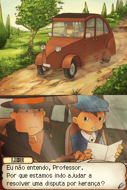

# Professor Layton and the Curious Village

## Informações sobre o jogo

| Tipo | Informação |
| ----------- | ----------- |
| Nome | Professor Layton and the Curious Village |
| Plataforma | [Nintendo DS](../) |
| Desenvolvedora | Level-5 |
| Distribuidora | Nintendo |
| Gênero | Puzzle |
| Data de Lançamento | 07/11/2008 |

## Informações sobre a tradução

| Tipo | Informação |
| ----------- | ----------- |
| Versão | 1\.0 |
| Última versão | Sim |
| Licença | CC BY-NC-ND 3.0 |
| Data de Lançamento | 29/07/2013 |
| Percentual traduzido | 100% |

## Autores

| Autor(a) | Papel na tradução |
| ----------- | ----------- |
| [Hansen](../../../autores/hansen/) | Completo |
| [alizor](../../../autores/alizor/) | Tradução |
| [Hyllian](../../../autores/hyllian/) | Completo |
| [Haru](../../../autores/haru/) | Gráficos |
| [spyblack](../../../autores/spyblack/) | Gráficos |
| [Solid\_One](../../../autores/solid_one/) | Gráficos e revisão |
| [Gamerulez](../../../autores/gamerulez/) | Revisão |
| [gamer\_boy](../../../autores/gamer_boy/) | Revisão |

## Grupos

* [Trans\-Center](../../../grupos/trans-center/)
* [PO\.B\.R\.E](../../../grupos/pobre/)
* [Monkey's Traduções](../../../grupos/monkeys-traducoes/)

## Informações sobre patching

| Aplicar o patch no arquivo | CRC32 Hash | MD5 Hash |
| ----------- | ----------- | ----------- |
| Professor Layton and the Curious Village \(EU\)\(M5\)\.nds | B1BB205B | 171D7A5004021A66C21964B81639EE53 |

## Páginas sobre a tradução

| URL | Oficial (publicado pelos autores) | Possuí link de download |
| ----------- | ----------- | ----------- |
| [https://jacutemsabao.bitbucket.io/download.html](https://jacutemsabao.bitbucket.io/download.html) | Sim | Sim |
| [https://romhackers.org/traducoes/portatil/nintendo-ds/professor-layton-and-the-curious-village-monkeys-traducoes/](https://romhackers.org/traducoes/portatil/nintendo-ds/professor-layton-and-the-curious-village-monkeys-traducoes/) | Não | Não |
| [https://joao13traducoes.com/2018/02/nds-professor-layton-and-the-curious-village-monkeys-traducoes-trans-center-e-pobre/](https://joao13traducoes.com/2018/02/nds-professor-layton-and-the-curious-village-monkeys-traducoes-trans-center-e-pobre/) | Não | Sim, porém o arquivo ou página de download exige uma senha |

## Imagens da tradução

