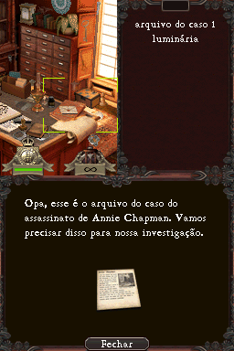
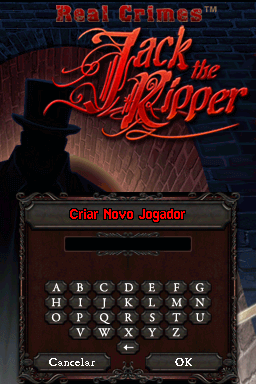
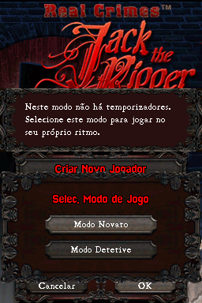
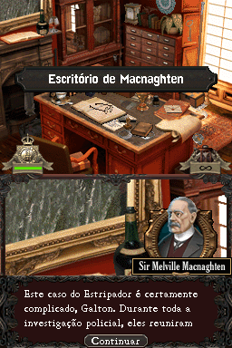
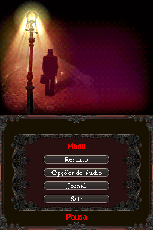
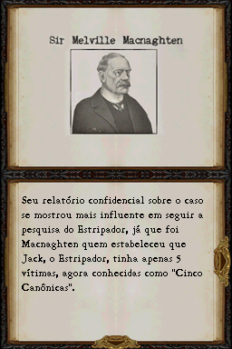

# Real Crimes - Jack The Ripper

## Informações sobre o jogo

| Tipo | Informação |
| ----------- | ----------- |
| Nome | Real Crimes \- Jack The Ripper |
| Plataforma | [Nintendo DS](../) |
| Desenvolvedora | Sanuk Games |
| Distribuidora | Virtual Playground |
| Gênero | Puzzle |
| Data de Lançamento | (Por volta de) ??/??/2010 |

## Informações sobre a tradução

| Tipo | Informação |
| ----------- | ----------- |
| Versão | 1\.0 |
| Última versão | Sim |
| URL Youtube | https://www.youtube.com/watch?v=JQhoBukxofM |
| Data de Lançamento | 06/05/2019 |
| Percentual traduzido | 100% |

## Autores

| Autor(a) | Papel na tradução |
| ----------- | ----------- |
| [hnnewgames](../../../autores/hnnewgames/) | Tradução e revisão |

## Informações sobre patching

| Aplicar o patch no arquivo | CRC32 Hash | MD5 Hash |
| ----------- | ----------- | ----------- |
| Real Crimes \- Jack the Ripper \(Europe\)\.nds | BDE23080 | 81437916B90B827066A7D8DC2EA0AA1A |

## Páginas sobre a tradução

| URL | Oficial (publicado pelos autores) | Possuí link de download |
| ----------- | ----------- | ----------- |
| [https://hnnewgamesofficial.blogspot.com/2019/05/real-crimes-jack-ripper-portugues-ds.html](https://hnnewgamesofficial.blogspot.com/2019/05/real-crimes-jack-ripper-portugues-ds.html) | Sim | Sim |
| [https://www.romhacking.net.br/index.php?topic=1144](https://www.romhacking.net.br/index.php?topic=1144) | Sim | Sim |
| [https://joao13traducoes.com/2019/05/nds-real-crimes-jack-ripper-hnnewgames/](https://joao13traducoes.com/2019/05/nds-real-crimes-jack-ripper-hnnewgames/) | Não | Sim, porém o arquivo ou página de download exige uma senha |

## Imagens da tradução

