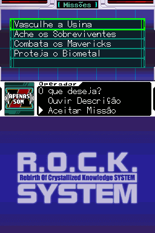
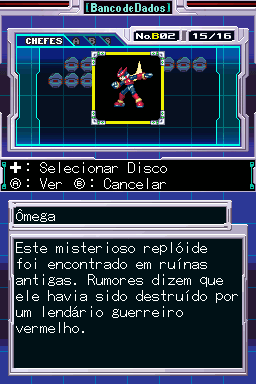
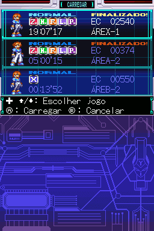
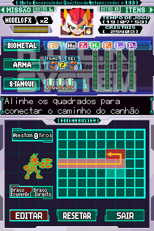
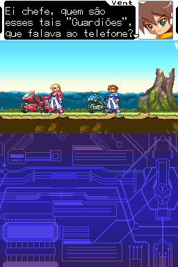
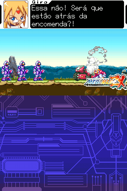
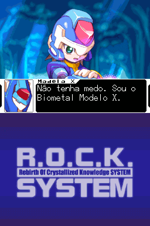
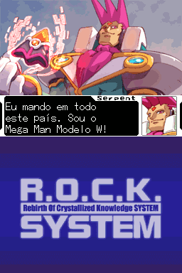
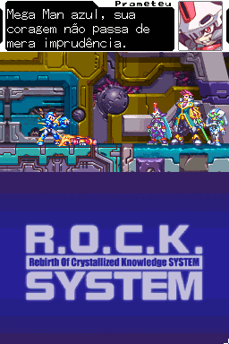
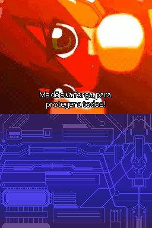

# Rock Man ZX

## Informações sobre o jogo

| Tipo | Informação |
| ----------- | ----------- |
| Nome | Rock Man ZX |
| Plataforma | [Nintendo DS](../) |
| Desenvolvedora | INTI CREATES |
| Distribuidora | Capcom |
| Gênero | Metroidvania |
| Data de Lançamento | 06/07/2006 |

## Informações sobre a tradução

| Tipo | Informação |
| ----------- | ----------- |
| Versão | 1\.2 |
| Última versão | Sim |
| URL Youtube | https://www.youtube.com/watch?v=Qs5dn5fuKVc |
| Data de Lançamento | 23/12/2017 |
| Percentual traduzido | 95% |

## Autores

| Autor(a) | Papel na tradução |
| ----------- | ----------- |
| [Solid\_One](../../../autores/solid_one/) | Completo |
| [Odin](../../../autores/odin/) | Romhacking e Tradução |
| [DiegoHH](../../../autores/diegohh/) | Romhacking e revisão |
| [Geo](../../../autores/geo/) | Revisão |

## Grupos

* [Trans\-Center](../../../grupos/trans-center/)

## Informações sobre patching

| Aplicar o patch no arquivo | CRC32 Hash | MD5 Hash |
| ----------- | ----------- | ----------- |
| Rockman ZX \(J\)\(WRG\)\.nds | B577BBE0 | F6C576C29A5B03DBCBAAC0B4B97EBE30 |

## Páginas sobre a tradução

| URL | Oficial (publicado pelos autores) | Possuí link de download |
| ----------- | ----------- | ----------- |
| [https://www.romhacking.net.br/index.php?topic=8](https://www.romhacking.net.br/index.php?topic=8) | Sim | Sim |
| [https://www.romhacking.net/translations/5181/](https://www.romhacking.net/translations/5181/) | Não | Sim |
| [https://romhackers.org/traducoes/portatil/nintendo-ds/rock-man-zx-trans-center/](https://romhackers.org/traducoes/portatil/nintendo-ds/rock-man-zx-trans-center/) | Não | Não |
| [https://joao13traducoes.com/2018/02/nds-rock-man-zx-trans-center](https://joao13traducoes.com/2018/02/nds-rock-man-zx-trans-center) | Não | Sim, porém o arquivo ou página de download exige uma senha |

## Imagens da tradução

