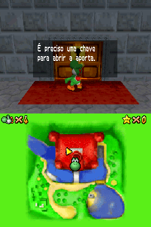

# Super Mario 64 DS

## Informações sobre o jogo

| Tipo | Informação |
| ----------- | ----------- |
| Nome | Super Mario 64 DS |
| Plataforma | [Nintendo DS](../) |
| Desenvolvedora | Nintendo |
| Distribuidora | Nintendo |
| Gênero | Ação / Plataforma |
| Data de Lançamento | 21/11/2004 |

## Informações sobre a tradução

| Tipo | Informação |
| ----------- | ----------- |
| Última versão | Sim |
| Data de Lançamento | 06/07/2021 |
| Percentual traduzido | 90% |

## Autores

| Autor(a) | Papel na tradução |
| ----------- | ----------- |
| [HeraldoPKG](../../../autores/heraldopkg/) | Completo |
| [LucasPKG](../../../autores/lucaspkg/) | Completo |

## Grupos

* [Traduções PKG](../../../grupos/traducoes-pkg/)

## Informações sobre patching

| Aplicar o patch no arquivo | CRC32 Hash | MD5 Hash |
| ----------- | ----------- | ----------- |
| Super Mario 64 DS \(E\)\.nds | 29715DEC | 867B3D17AD268E10357C9754A77147E5 |

## Páginas sobre a tradução

| URL | Oficial (publicado pelos autores) | Possuí link de download |
| ----------- | ----------- | ----------- |
| [https://traducoespkg.tumblr.com/post/656011277273120768/mario-64-ds-download-do-patch-tutorial](https://traducoespkg.tumblr.com/post/656011277273120768/mario-64-ds-download-do-patch-tutorial) | Sim | Sim |
| [https://www.romhacking.net.br/index.php?topic=1914](https://www.romhacking.net.br/index.php?topic=1914) | Sim | Sim |
| [https://joao13traducoes.com/2021/07/nds-super-mario-64-ds-traducoespkg/](https://joao13traducoes.com/2021/07/nds-super-mario-64-ds-traducoespkg/) | Não | Sim, porém o arquivo ou página de download exige uma senha |

## Imagens da tradução

