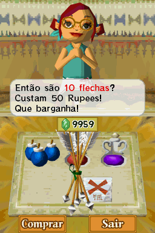

# The Legend of Zelda - Phantom Hourglass

## Informações sobre o jogo

| Tipo | Informação |
| ----------- | ----------- |
| Nome | The Legend of Zelda \- Phantom Hourglass |
| Plataforma | [Nintendo DS](../) |
| Desenvolvedora | Nintendo |
| Distribuidora | Nintendo |
| Gênero | RPG / Ação |
| Data de Lançamento | 23/06/2007 |

## Informações sobre a tradução

| Tipo | Informação |
| ----------- | ----------- |
| Versão | 0\.9 |
| Última versão | Sim |
| Data de Lançamento | 06/02/2011 |
| Percentual traduzido | 95% |

## Autores

| Autor(a) | Papel na tradução |
| ----------- | ----------- |
| [Aloprado](../../../autores/aloprado/) | Romhacking |
| [Dank](../../../autores/dank/) | Romhacking e revisão |
| [Kayo Furtado](../../../autores/kayo-furtado/) | Tradução |
| [Luis Gustavo](../../../autores/luis-gustavo/) | Tradução |
| [William Otaku](../../../autores/william-otaku/) | Tradução |
| [Solid\_One](../../../autores/solid_one/) | Gráficos |
| [Aero](../../../autores/aero/) | Tradução |
| [Chapolink](../../../autores/chapolink/) | Tradução |
| [Luki4n](../../../autores/luki4n/) | Tradução |
| [Shikamaru](../../../autores/shikamaru/) | Tradução |
| [The\_Owl](../../../autores/the_owl/) | Tradução |
| [X\_Bacon](../../../autores/x_bacon/) | Tradução |
| [Marvin Dalkiri](../../../autores/marvin-dalkiri/) | Tradução |
| [Sonic Away](../../../autores/sonic-away/) | Tradução |

## Grupos

* [Trans\-Center](../../../grupos/trans-center/)
* [Monkey's Traduções](../../../grupos/monkeys-traducoes/)
* [Projeto BR](../../../grupos/projeto-br/)
* [Hyrule Legends](../../../grupos/hyrule-legends/)

## Informações sobre patching

| Aplicar o patch no arquivo | CRC32 Hash | MD5 Hash |
| ----------- | ----------- | ----------- |
| Zelda Phantom Hourglass \(U\)\(iND\)\.nds | 8B431C41 | 745E372BDE611C2CEB3EC5DB2BBEB77A |

## Páginas sobre a tradução

| URL | Oficial (publicado pelos autores) | Possuí link de download |
| ----------- | ----------- | ----------- |
| [https://www.romhacking.net/translations/5265/](https://www.romhacking.net/translations/5265/) | Não | Sim |
| [https://romhackers.org/traducoes/portatil/nintendo-ds/the-legend-of-zelda-phantom-hourglass-projeto-br-trans-center-hyrule-legends-e-monkeys-traducoes/](https://romhackers.org/traducoes/portatil/nintendo-ds/the-legend-of-zelda-phantom-hourglass-projeto-br-trans-center-hyrule-legends-e-monkeys-traducoes/) | Não | Não |
| [https://joao13traducoes.com/2018/02/nds-the-legend-of-zelda-phantom-hourglass-projeto-br-trans-center-hyrule-legends-e-monkeys-traducoes](https://joao13traducoes.com/2018/02/nds-the-legend-of-zelda-phantom-hourglass-projeto-br-trans-center-hyrule-legends-e-monkeys-traducoes) | Não | Sim, porém o arquivo ou página de download exige uma senha |

## Imagens da tradução

