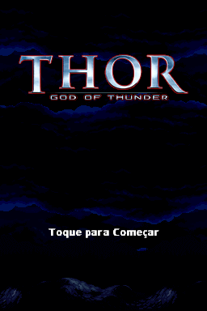
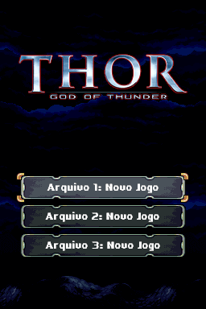
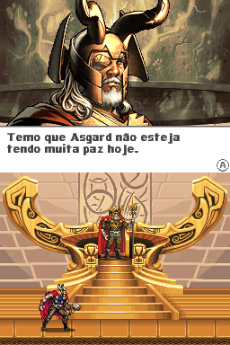
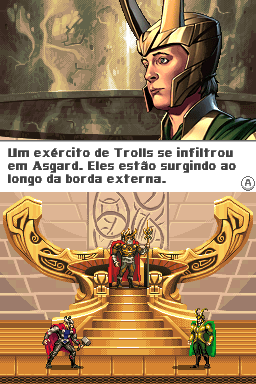
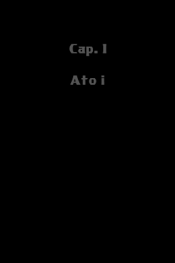

# Thor - God of Thunder

## Informações sobre o jogo

| Tipo | Informação |
| ----------- | ----------- |
| Nome | Thor \- God of Thunder |
| Plataforma | [Nintendo DS](../) |
| Desenvolvedora | WayForward |
| Distribuidora | SEGA |
| Gênero | Beat 'em up |
| Data de Lançamento | 28/04/2011 |

## Informações sobre a tradução

| Tipo | Informação |
| ----------- | ----------- |
| Última versão | Sim |
| Data de Lançamento | 29/05/2019 |
| Percentual traduzido | 100% |

## Autores

| Autor(a) | Papel na tradução |
| ----------- | ----------- |
| [hnnewgames](../../../autores/hnnewgames/) | Completo |

## Informações sobre patching

| Aplicar o patch no arquivo | CRC32 Hash | MD5 Hash |
| ----------- | ----------- | ----------- |
| Thor \- God of Thunder \(Europe\) \(En,Fr,De,Es,It\)\.nds | 0E594AE6 | 991398C960743C2D8FB88FF3A3C4A44E |
| Thor \- God of Thunder \(USA\) \(En,Fr,De,Es,It\) \[b\]\.nds | 1D8E8CF7 | 2C6280B4DDF28DEB74C60B2976D651D5 |

## Páginas sobre a tradução

| URL | Oficial (publicado pelos autores) | Possuí link de download |
| ----------- | ----------- | ----------- |
| [https://hnnewgamesofficial.blogspot.com/2019/05/thor-god-of-thunder-portugues-ds.html](https://hnnewgamesofficial.blogspot.com/2019/05/thor-god-of-thunder-portugues-ds.html) | Sim | Sim |
| [https://www.romhacking.net.br/index.php?topic=1179](https://www.romhacking.net.br/index.php?topic=1179) | Sim | Sim |
| [https://joao13traducoes.com/2019/05/nds-thor-god-of-thunder-hnnewgames/](https://joao13traducoes.com/2019/05/nds-thor-god-of-thunder-hnnewgames/) | Não | Sim |

## Imagens da tradução

