# Trauma Center - Under The Knife

## Informações sobre o jogo

| Tipo | Informação |
| ----------- | ----------- |
| Nome | Trauma Center \- Under The Knife |
| Plataforma | [Nintendo DS](../) |
| Desenvolvedora | Atlus |
| Distribuidora | Atlus |
| Gênero | Simulação |
| Data de Lançamento | 04/10/2005 |

## Informações sobre a tradução

| Tipo | Informação |
| ----------- | ----------- |
| Versão | 1\.0 |
| Última versão | Sim |
| URL Youtube | https://www.youtube.com/watch?v=cuT6HUCpA4o |
| Data de Lançamento | 26/11/2020 |
| Percentual traduzido | 100% |

## Autores

| Autor(a) | Papel na tradução |
| ----------- | ----------- |
| [Magalicia](../../../autores/magalicia/) | Tradução e revisão |
| [Denim](../../../autores/denim/) | Romhacking |
| [Solid\_One](../../../autores/solid_one/) | Gráficos e revisão |
| [Sliter](../../../autores/sliter/) | Gráficos |
| [Huskie](../../../autores/huskie/) | Tradução |
| [Kosmus](../../../autores/kosmus/) | Revisão |
| [Cláudia Akiko](../../../autores/claudia-akiko/) | Dublagem |
| [Zizibs](../../../autores/zizibs/) | Dublagem |
| [Legends](../../../autores/legends/) | Dublagem |

## Informações sobre patching

| Aplicar o patch no arquivo | CRC32 Hash | MD5 Hash |
| ----------- | ----------- | ----------- |
| Trauma Center \- Under the Knife \(U\)\.nds | 0622460A | A60071BC7ADC9BAB2D64F454E49E118F |

## Páginas sobre a tradução

| URL | Oficial (publicado pelos autores) | Possuí link de download |
| ----------- | ----------- | ----------- |
| [https://www.romhacking.net.br/index.php?topic=422](https://www.romhacking.net.br/index.php?topic=422) | Sim | Sim, porém é necessário realizar login |
| [https://www.romhacking.net/translations/5774/](https://www.romhacking.net/translations/5774/) | Não | Sim |
| [https://joao13traducoes.com/2020/12/nds-trauma-center-under-the-knife-traduzido-e-dublado-varios-autores/](https://joao13traducoes.com/2020/12/nds-trauma-center-under-the-knife-traduzido-e-dublado-varios-autores/) | Não | Sim, porém o arquivo ou página de download exige uma senha |

## Imagens da tradução

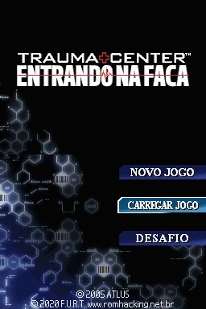
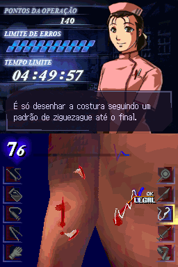
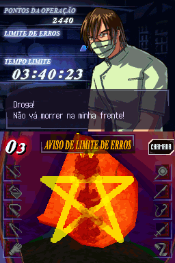
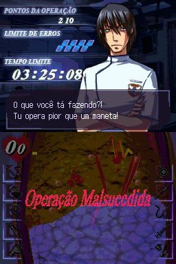
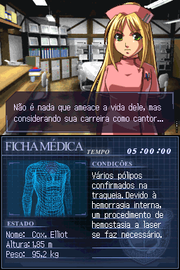
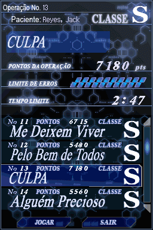
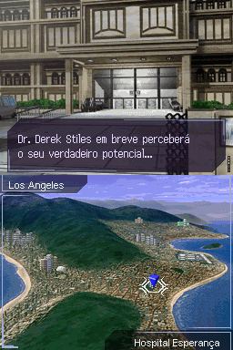
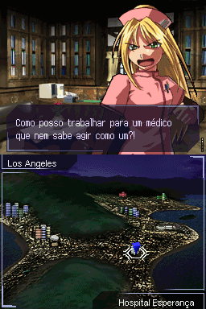
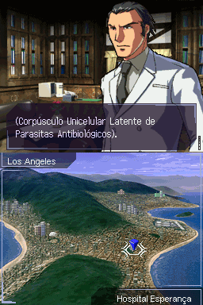
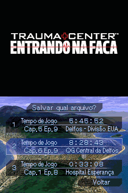
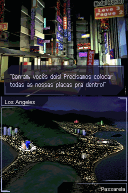
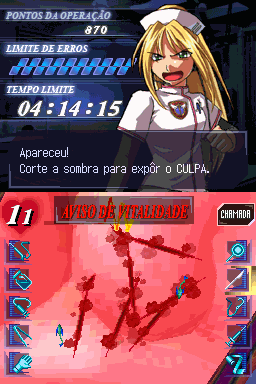