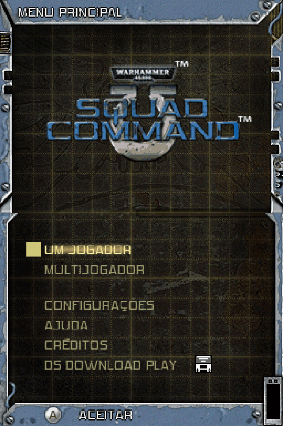

# Warhammer 40,000 - Squad Command

## Informações sobre o jogo

| Tipo | Informação |
| ----------- | ----------- |
| Nome | Warhammer 40,000 \- Squad Command |
| Plataforma | [Nintendo DS](../) |
| Desenvolvedora | Ubisoft |
| Distribuidora | THQ |
| Gênero | RPG / Estratégia |
| Data de Lançamento | 06/12/2007 |

## Informações sobre a tradução

| Tipo | Informação |
| ----------- | ----------- |
| Última versão | Sim |
| Data de Lançamento | 11/09/2018 |
| Percentual traduzido | 90% |

## Autores

| Autor(a) | Papel na tradução |
| ----------- | ----------- |
| [Kassio Cruz](../../../autores/kassio-cruz/) | Completo |

## Informações sobre patching

| Aplicar o patch no arquivo | CRC32 Hash | MD5 Hash |
| ----------- | ----------- | ----------- |
| Warhammer 40,000 \- Squad Command \(E\)\(EXiMiUS\)\.nds | 491934C3 | 58095AFDE846622BC13F40ABB06643A0 |

## Páginas sobre a tradução

| URL | Oficial (publicado pelos autores) | Possuí link de download |
| ----------- | ----------- | ----------- |
| [https://www.romhacking.net.br/index.php?topic=829](https://www.romhacking.net.br/index.php?topic=829) | Sim | Sim, porém é necessário realizar login |
| [https://joao13traducoes.com/2018/09/nds-warhammer-40000-squad-command-kassio-cruz/](https://joao13traducoes.com/2018/09/nds-warhammer-40000-squad-command-kassio-cruz/) | Não | Sim, porém o arquivo ou página de download exige uma senha |

## Imagens da tradução

